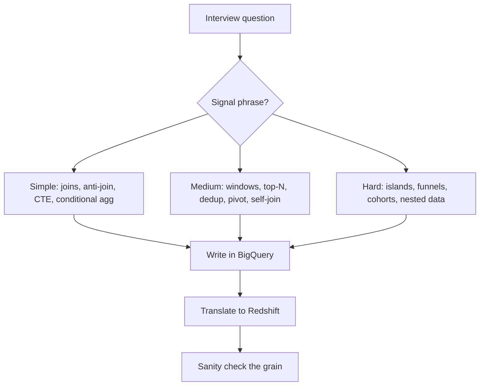

# 3. SQL PLAYBOOK — BigQuery → Redshift

> My SQL playbook for the **Lead Analytics Engineer (PlayStation Studios)** 90-min technical round.
> Every pattern shows **BigQuery** (my native dialect) **and** the **Redshift** equivalent, ordered **simple → medium → hard**.
> Companion docs: `1_GATHER_CONTEXT.md` (facts), `2_FOCUS_CONTEXT.md` (plan).


## How to use this
- Match the interviewer's words to a pattern with the **cheat sheet** below, then jump to that section.
- Each pattern = **What it is** → **BigQuery** → **Redshift** → **Gotcha** (when it breaks).
- Scenarios are real-company style (Amazon, Netflix, Meta, Spotify), not toy examples.




## The mindset (before any query)
1. **Grain first** — say out loud what one output row is: "one row per user per day".
2. **Plan out loud** — "filter to completed orders, group by week, then LAG".
3. **Build in pieces** — small CTEs, talk as you go.
4. **Check** — does the total reconcile? Any impossible values?
5. **Understand before coding** (1-2 min of questions), **talk while you work**, **prefer portable ANSI SQL**, **fewest table scans**.


## Signal phrase → pattern (cheat sheet)

| If the interviewer says… | Pattern | Section |
|---|---|---|
| "first / second / nth highest" | Window rank (`DENSE_RANK`) | 2.1 |
| "top N per group / in each department" | `ROW_NUMBER() OVER (PARTITION BY …)` | 2.4 |
| "rolling" / "cumulative" / "moving average" | Window frame (`ROWS BETWEEN`) | 2.3 |
| "compare to previous day / week-over-week" | `LAG` | 2.2 |
| "users who have no X / never did Y" | Anti-join (`LEFT JOIN … IS NULL`) | 1.2 |
| "count multiple things with a condition" | `COUNTIF` / `SUM(CASE WHEN)` | 1.4 |
| "X by country / metric by dimension" | `GROUP BY` | 1.1 |
| "deduplicate / keep the latest per key" | `QUALIFY ROW_NUMBER() = 1` | 2.5 |
| "consecutive / streak / find gaps" | Gaps-and-islands | 3.1 |
| "funnel / conversion path" | Conditional aggregation + CTE | 3.3 |
| "retention by signup cohort" | Cohort self-join | 3.4 |
| "nested / repeated fields" | `UNNEST` (BQ) / `SUPER` (RS) | 3.5 |


## 1. Simple patterns


### 1.1 Joins & grain

**What it is:** `JOIN` combines rows from two tables on a key. **Grain** = what one row of a table/result means (e.g. "one row per order line").

**Why it matters:** joining two tables at *different* grains double-counts rows. State the grain before you join.

| Join | Keeps |
|---|---|
| `INNER` | only rows that match in both |
| `LEFT` | all left rows + matches from right |
| `RIGHT` | all right rows + matches from left |
| `FULL OUTER` | all rows from both |

**Scenario (Amazon):** "Revenue by customer segment, *including* segments with zero orders."

```sql
-- BigQuery AND Redshift (ANSI, identical)
SELECT
  s.segment,
  COALESCE(SUM(o.amount), 0) AS revenue
FROM segments s
LEFT JOIN orders o ON o.segment_id = s.id
GROUP BY s.segment;
```

**Gotcha:** putting a filter on the *right* table in `WHERE` silently turns a `LEFT JOIN` into an `INNER JOIN`. Right-table filters go in the `ON` clause:

```sql
-- WRONG: drops segments with zero orders
LEFT JOIN orders o ON o.segment_id = s.id
WHERE o.status = 'paid'

-- RIGHT: keep the LEFT semantics
LEFT JOIN orders o ON o.segment_id = s.id AND o.status = 'paid'
```


### 1.2 Anti-join / "find missing"

**What it is:** rows that have **no match** in another table — "users who have no friends", "users who never ordered".

Three ways, in order of preference:

```sql
-- 1) BEST: LEFT JOIN + IS NULL (BigQuery AND Redshift)
SELECT u.user_id
FROM users u
LEFT JOIN friends f ON u.user_id = f.user_id
WHERE f.user_id IS NULL;

-- 2) FAST: NOT EXISTS (short-circuits on first match)
SELECT u.user_id
FROM users u
WHERE NOT EXISTS (SELECT 1 FROM friends f WHERE f.user_id = u.user_id);

-- 3) AVOID: NOT IN (breaks if the subquery returns NULL)
SELECT user_id FROM users
WHERE user_id NOT IN (SELECT user_id FROM friends);
```

**Gotcha:** `NOT IN` returns *no rows* if the subquery contains a `NULL`. Always prefer `NOT EXISTS` or `LEFT JOIN … IS NULL`.


### 1.3 CTEs (Common Table Expressions)

**What it is:** a `WITH` block = a named, temporary result you can reuse. It reads top-to-bottom and keeps big queries understandable.

```sql
-- BigQuery AND Redshift
WITH daily AS (
  SELECT user_id, DATE(created_at) AS d, SUM(amount) AS revenue
  FROM orders
  GROUP BY 1, 2
)
SELECT d, SUM(revenue) AS total
FROM daily
GROUP BY d
ORDER BY d;
```

**Why it matters:** prefer a `WITH` over a nested subquery — it keeps your thought process visible to the interviewer.


### 1.4 Conditional aggregation — KEY BigQuery → Redshift difference

**What it is:** count or sum rows that match a condition, all in **one pass** (one table scan).

**Scenario (Meta):** "How many users liked, shared, and commented in one query?"

```sql
-- BigQuery: COUNTIF
SELECT
  COUNTIF(event = 'like')    AS likes,
  COUNTIF(event = 'share')   AS shares,
  COUNTIF(event = 'comment') AS comments
FROM events;

-- Redshift: SUM(CASE WHEN ... THEN 1 ELSE 0 END)
SELECT
  SUM(CASE WHEN event = 'like'    THEN 1 ELSE 0 END) AS likes,
  SUM(CASE WHEN event = 'share'   THEN 1 ELSE 0 END) AS shares,
  SUM(CASE WHEN event = 'comment' THEN 1 ELSE 0 END) AS comments
FROM events;
```

**Why it matters:** one scan beats three `WHERE event = … UNION ALL` scans (fewest table scans).

**Gotcha:** BigQuery's `COUNTIF` / `SUMIF` don't exist in Redshift — always translate to `SUM(CASE WHEN …)`.


## 2. Medium patterns


### 2.1 Window functions — ROW_NUMBER / RANK / DENSE_RANK

**What it is:** a **window function** computes over a set of rows ("window") without collapsing them, unlike `GROUP BY`. `PARTITION BY` splits the window into groups; `ORDER BY` sets the order inside each.

**The tie question** (scores `100, 100, 90, 80`):

| Function | Output | Meaning |
|---|---|---|
| `ROW_NUMBER()` | 1, 2, 3, 4 | always unique, no gaps |
| `RANK()` | 1, 1, 3, 4 | ties share rank, **skips** numbers |
| `DENSE_RANK()` | 1, 1, 2, 3 | ties share rank, **no gaps** |

**Scenario (Meta/Amazon classic):** "Second highest salary."

```sql
-- BigQuery AND Redshift (DENSE_RANK handles ties correctly)
SELECT salary
FROM (
  SELECT salary, DENSE_RANK() OVER (ORDER BY salary DESC) AS rnk
  FROM employees
)
WHERE rnk = 2;

-- Alternative without a window (portable ANSI):
SELECT MAX(salary) AS second_highest
FROM employees
WHERE salary < (SELECT MAX(salary) FROM employees);
```

**Gotcha:** use `DENSE_RANK` for "nth highest" (so two people tied at the top don't break "2nd"). Use `ROW_NUMBER` for a strict, unique pick (e.g. "top 1 per group").


### 2.2 LAG / LEAD (compare to previous / next)

**What it is:** `LAG(col)` = the value from the previous row; `LEAD(col)` = the next row. Use it for "day-over-day", "week-over-week", "compare to previous".

**Scenario (Spotify):** "Days where streams were higher than the previous day."

```sql
-- BigQuery AND Redshift
WITH daily AS (
  SELECT DATE(listened_at) AS d, COUNT(*) AS streams
  FROM listens
  GROUP BY 1
)
SELECT d, streams
FROM (
  SELECT d, streams, LAG(streams) OVER (ORDER BY d) AS prev
  FROM daily
)
WHERE streams > prev;
```

**Gotcha:** `LAG/LEAD` need a deterministic `ORDER BY`; otherwise rows are unordered and the result is wrong.


### 2.3 Running totals & moving averages

**What it is:** cumulative sums / rolling averages over a time series. Signal words: **"rolling", "cumulative", "moving average"**.

```sql
-- BigQuery AND Redshift (ROWS frame is identical)
SELECT
  order_date,
  daily_revenue,
  SUM(daily_revenue) OVER (ORDER BY order_date
    ROWS BETWEEN UNBOUNDED PRECEDING AND CURRENT ROW) AS running_total,
  AVG(daily_revenue) OVER (ORDER BY order_date
    ROWS BETWEEN 6 PRECEDING AND CURRENT ROW) AS ma_7day
FROM daily_revenue;
```

**Gotcha:** use `ROWS BETWEEN … PRECEDING AND CURRENT ROW` (not `RANGE`) for a *fixed number of rows*; `RANGE` groups ties and can give wrong rolling counts.


### 2.4 Top-N per group

**What it is:** "top 3 X *in each group*" — a `ROW_NUMBER()` partitioned by the group.

**Scenario (Amazon):** "Top 3 salaries per department."

```sql
-- BigQuery AND Redshift
SELECT department, employee_name, salary
FROM (
  SELECT department, employee_name, salary,
         ROW_NUMBER() OVER (PARTITION BY department ORDER BY salary DESC) AS rn
  FROM employees
)
WHERE rn <= 3;
```

**Gotcha:** to keep ties (two people with the same top salary), use `DENSE_RANK` and `<= 3`; to pick *exactly* N rows, use `ROW_NUMBER`.


### 2.5 Deduplication (keep latest / earliest per key)

**What it is:** one row per key, keeping the newest (or oldest) record.

**Scenario (Spotify):** "Keep each user's latest subscription status."

```sql
-- BigQuery AND Redshift: both support QUALIFY
SELECT *
FROM subscriptions
QUALIFY ROW_NUMBER() OVER (PARTITION BY user_id ORDER BY updated_at DESC) = 1;

-- Portable version (works everywhere, incl. MySQL/Postgres):
SELECT *
FROM (
  SELECT *, ROW_NUMBER() OVER (PARTITION BY user_id ORDER BY updated_at DESC) AS rn
  FROM subscriptions
)
WHERE rn = 1;
```

**Gotcha:** `QUALIFY` filters on a window function *after* it's computed — it's not in MySQL, so in a "basic MySQL" screener, fall back to the subquery version.


### 2.6 Pivot (CASE WHEN)

**What it is:** turn values in one column into columns. Manual pivot = conditional aggregation with `GROUP BY`.

**Scenario (Amazon):** "Monthly revenue per department, months as columns."

```sql
-- BigQuery AND Redshift (manual pivot)
SELECT
  department,
  SUM(CASE WHEN month = 'Jan' THEN revenue ELSE 0 END) AS jan,
  SUM(CASE WHEN month = 'Feb' THEN revenue ELSE 0 END) AS feb,
  SUM(CASE WHEN month = 'Mar' THEN revenue ELSE 0 END) AS mar
FROM dept_revenue
GROUP BY department;
```

**Gotcha:** a manual pivot needs one `CASE WHEN` per output column — know the distinct values up front (or generate SQL dynamically).


### 2.7 Self-join

**What it is:** join a table to *itself* (give it two aliases). Classic for "compare a row to a related row in the same table".

**Scenario (Amazon):** "Employees earning more than their manager."

```sql
-- BigQuery AND Redshift
SELECT e.name AS employee
FROM employee e
JOIN employee m ON e.manager_id = m.id
WHERE e.salary > m.salary;
```

**Gotcha:** a self-join can *also* replicate `LAG/LEAD` (join on the previous key) — some teams demand pure ANSI SQL, so know this trick:

```sql
-- LAG/LEAD equivalent via self-join (portable ANSI)
SELECT a.d, a.value - b.value AS day_over_day
FROM daily a
LEFT JOIN daily b ON b.d = DATE_SUB(a.d, INTERVAL 1 DAY);
```


### 2.8 Approximate distinct count

**What it is:** a fast, *approximate* `COUNT(DISTINCT …)` for huge tables. Slightly imprecise, much cheaper.

```sql
-- BigQuery
SELECT APPROX_COUNT_DISTINCT(user_id) AS approx_users
FROM events;

-- Redshift
SELECT APPROXIMATE COUNT(DISTINCT user_id) AS approx_users
FROM events;
```

**Gotcha:** use it for exploratory/trend numbers, never for exact reconciliation or billing.


## 3. Hard patterns


### 3.1 Gaps-and-islands

**What it is:** group *consecutive* values into "islands" (runs) and find "gaps" between them. The trick: subtract a `ROW_NUMBER()` from the value — consecutive values get the **same** group id.

**Scenario (Cinema, LeetCode):** "Find all blocks of 2+ consecutive free seats."

```sql
-- BigQuery AND Redshift (integer arithmetic, identical)
WITH numbered AS (
  SELECT seat_id,
         seat_id - ROW_NUMBER() OVER (ORDER BY seat_id) AS grp
  FROM cinema
  WHERE free = 1
)
SELECT grp, MIN(seat_id) AS start_seat, MAX(seat_id) AS end_seat, COUNT(*) AS consecutive
FROM numbered
GROUP BY grp
HAVING COUNT(*) >= 2;
```

**Scenario (PlayStation, dates):** "Player sessions — a new session starts after 30 min of inactivity."

```sql
-- BigQuery (timestamp diff)
-- Redshift uses DATEDIFF(minute, prev_ts, event_timestamp) instead of TIMESTAMP_DIFF
WITH flagged AS (
  SELECT user_id, event_timestamp,
         LAG(event_timestamp) OVER (PARTITION BY user_id ORDER BY event_timestamp) AS prev_ts
  FROM raw_events
)
SELECT user_id, event_timestamp,
       SUM(CASE WHEN prev_ts IS NULL OR TIMESTAMP_DIFF(event_timestamp, prev_ts, MINUTE) > 30
                THEN 1 ELSE 0 END)
         OVER (PARTITION BY user_id ORDER BY event_timestamp) AS session_id
FROM flagged;
```

**Gotcha:** the subtract-`ROW_NUMBER` trick needs a stable sort; ties/duplicates break the grouping.


### 3.2 Consecutive sequences

**What it is:** find values that repeat N times in a row (using `LAG` twice).

**Scenario (LeetCode 180):** "Numbers that appear 3 times consecutively."

```sql
-- BigQuery AND Redshift
WITH c AS (
  SELECT num,
         LAG(num, 1) OVER (ORDER BY id) AS prev1,
         LAG(num, 2) OVER (ORDER BY id) AS prev2
  FROM logs
)
SELECT DISTINCT num
FROM c
WHERE num = prev1 AND num = prev2;
```


### 3.3 Funnel analysis

**What it is:** measure how many users move step-by-step through a path (view → cart → purchase).

**Scenario (Netflix/Spotify):** "Funnel: viewed → added to cart → purchased."

```sql
-- BigQuery (IF + COUNTIF)
WITH steps AS (
  SELECT user_id,
         MIN(IF(event = 'view',     ts, NULL)) AS view_ts,
         MIN(IF(event = 'cart',     ts, NULL)) AS cart_ts,
         MIN(IF(event = 'purchase', ts, NULL)) AS purchase_ts
  FROM events
  GROUP BY user_id
)
SELECT
  COUNTIF(view_ts     IS NOT NULL) AS viewed,
  COUNTIF(cart_ts     IS NOT NULL AND cart_ts     > view_ts) AS added_to_cart,
  COUNTIF(purchase_ts IS NOT NULL AND purchase_ts > cart_ts) AS purchased
FROM steps;

-- Redshift (CASE WHEN + SUM)
WITH steps AS (
  SELECT user_id,
         MIN(CASE WHEN event = 'view'     THEN ts END) AS view_ts,
         MIN(CASE WHEN event = 'cart'     THEN ts END) AS cart_ts,
         MIN(CASE WHEN event = 'purchase' THEN ts END) AS purchase_ts
  FROM events
  GROUP BY user_id
)
SELECT
  SUM(CASE WHEN view_ts     IS NOT NULL THEN 1 ELSE 0 END) AS viewed,
  SUM(CASE WHEN cart_ts     IS NOT NULL AND cart_ts     > view_ts THEN 1 ELSE 0 END) AS added_to_cart,
  SUM(CASE WHEN purchase_ts IS NOT NULL AND purchase_ts > cart_ts THEN 1 ELSE 0 END) AS purchased
FROM steps;
```

**Gotcha:** a *sequential* funnel requires timestamps to be ordered (step N after step N-1), not just present.


### 3.4 Cohort / retention analysis

**What it is:** group users by signup month, then measure how many stay active in later months.

**Scenario (Spotify):** "Monthly retention by signup cohort."

```sql
-- BigQuery
WITH cohorts AS (
  SELECT user_id, DATE_TRUNC(signup_date, MONTH) AS cohort
  FROM users
),
activity AS (
  SELECT user_id, DATE_TRUNC(activity_date, MONTH) AS act_month
  FROM events
  GROUP BY 1, 2
)
SELECT c.cohort,
       DATE_DIFF(a.act_month, c.cohort, MONTH) AS month_num,
       COUNT(DISTINCT a.user_id) AS active_users
FROM cohorts c
JOIN activity a USING (user_id)
GROUP BY 1, 2
ORDER BY 1, 2;

-- Redshift: two differences
--   DATE_TRUNC('month', signup_date)   (quoted unit, not MONTH)
--   DATEDIFF(month, c.cohort, a.act_month)  (part first)
```

**Gotcha:** `DATE_TRUNC` syntax differs — BigQuery `DATE_TRUNC(d, MONTH)`, Redshift `DATE_TRUNC('month', d)`. And `DATE_DIFF(a, b, X)` (BQ) = `DATEDIFF(x, b, a)` (RS).


### 3.5 Nested data — ARRAY/STRUCT (UNNEST) → SUPER/JSON

**What it is:** a column can hold a list (`ARRAY`) or object (`STRUCT`) in BigQuery; Redshift stores these in a `SUPER` column.

```sql
-- BigQuery: flatten an array with UNNEST
SELECT t.user_id, item.product, item.price
FROM transactions t
CROSS JOIN UNNEST(t.items) AS item;

-- Redshift: SUPER type + PartiQL (comma-join flattens the array)
SELECT t.user_id, item.product, item.price
FROM transactions t, t.items AS item;

-- Redshift: JSON path extraction (from a SUPER/JSON column)
SELECT JSON_EXTRACT_PATH_TEXT(JSON_SERIALIZE(payload), 'user_id') AS user_id
FROM staging.raw_telemetry;
```

**Gotcha:** BigQuery flattens with `UNNEST`; Redshift flattens a `SUPER` array with a comma-join (PartiQL) or extracts fields with `JSON_EXTRACT_PATH_TEXT`.


### 3.6 Complex multi-step (nested CTEs)

**What it is:** chain several CTEs, one logical step per CTE, filtering/aggregating before each join.

```sql
-- BigQuery AND Redshift (pattern, not syntax)
WITH filtered AS (
  SELECT * FROM orders WHERE order_date >= '2026-01-01'   -- filter early
),
user_totals AS (
  SELECT user_id, SUM(amount) AS total
  FROM filtered
  GROUP BY user_id                                        -- aggregate before join
)
SELECT c.country, COUNT(r.user_id) AS buyers, SUM(r.total) AS revenue
FROM user_totals r
JOIN customers c ON c.user_id = r.user_id                 -- co-located join
GROUP BY c.country;
```

**Gotcha:** keep each CTE **single-purpose** — this is also how you hand readable, testable SQL to an AI agent or reviewer.


## 4. Optimization (onsite-style)

Your 90-min round is **onsite-style**: expect table scans, `EXPLAIN`, and physical-design questions — not just "write the query".


### 4.1 Fewest table scans

**Rule:** solve the question with the **minimum number of passes** over the table.

```sql
-- One scan (good): conditional aggregation
SELECT
  COUNT(CASE WHEN status = 'completed' THEN 1 END) AS completed,
  COUNT(CASE WHEN status = 'refunded'  THEN 1 END) AS refunded
FROM orders;

-- Two scans (avoid): UNION ALL forces a second read
SELECT COUNT(*) FROM orders WHERE status = 'completed'
UNION ALL
SELECT COUNT(*) FROM orders WHERE status = 'refunded';
```


### 4.2 Query plans (`EXPLAIN`)

**What it is:** `EXPLAIN` shows *how* the database executes a query (scans, joins, sorts) without running it.

- **Redshift** has `EXPLAIN` and system views:
  - `svl_query_report` — per-step rows, bytes, `is_diskbased` (spilled to disk).
  - `stl_explain` — the plan; watch for `DS_DIST_INNER` / `DS_DIST_ALL_NONE` (data reshuffled across nodes = bad).
- **BigQuery** has no classic `EXPLAIN`; use `bq query --dry_run` to see bytes scanned, and the console execution graph.

**The Redshift tuning sequence (4 steps):**
1. `svl_query_report` → find `is_diskbased = true` or huge `output_bytes` (the bottleneck).
2. `stl_explain` → find `DS_DIST_*` steps (network shuffle).
3. Check the `SORTKEY` column is used in `WHERE`; run `ANALYZE <table>`.
4. Refactor CTEs to filter/aggregate *before* joining.


### 4.3 Redshift physical design — the BigQuery → Redshift shift

**BigQuery** auto-manages storage (partitioning/clustering, serverless). **Redshift** needs you to set physical layout manually:

| Term | Definition (plain English) |
|---|---|
| `DISTKEY` | the column Redshift uses to decide **which node** stores a row — set it on the join column so joined rows live on the same node (no network shuffle) |
| `SORTKEY` | orders rows **on disk** so Redshift can skip blocks it doesn't need (block pruning) — set it on the time column you filter on |
| `DISTSTYLE` | how rows are spread: `KEY` (by DISTKEY), `EVEN` (round-robin), `ALL` (copy small dim to every node) |
| `VACUUM` / `ANALYZE` | housekeeping: `VACUUM` reclaims space + re-sorts, `ANALYZE` refreshes stats for the planner |

```sql
-- Redshift: create a fact table tuned for user joins + date filters
CREATE TABLE fact_orders (
  order_id  BIGINT NOT NULL,
  user_id   BIGINT NOT NULL DISTKEY,   -- co-locate by user
  amount    DECIMAL(18,2),
  order_ts  TIMESTAMP NOT NULL SORTKEY -- prune by date
);

ANALYZE fact_orders;
VACUUM SORT ONLY fact_orders;
```

**Redshift has no B-tree indexes.** "Add an index" is the wrong answer — the Redshift answer is "set DISTKEY/SORTKEY and ANALYZE/VACUUM".

---


## Appendix: Dialect map (BigQuery → Redshift)

| Concept | BigQuery | Redshift |
|---|---|---|
| Conditional count | `COUNTIF(cond)` | `SUM(CASE WHEN cond THEN 1 ELSE 0 END)` |
| Conditional value | `IF(cond, a, b)` | `CASE WHEN cond THEN a ELSE b END` |
| Approx distinct | `APPROX_COUNT_DISTINCT(x)` | `APPROXIMATE COUNT(DISTINCT x)` |
| String aggregate | `STRING_AGG(x ORDER BY x)` | `LISTAGG(x, ', ') WITHIN GROUP (ORDER BY x)` |
| Nested data | `ARRAY` / `STRUCT` + `UNNEST` | `SUPER` + PartiQL comma-join / `JSON_EXTRACT_PATH_TEXT` |
| Dedup filter | `QUALIFY ROW_NUMBER() … = 1` | `QUALIFY ROW_NUMBER() … = 1` |
| Date truncate | `DATE_TRUNC(d, MONTH)` | `DATE_TRUNC('month', d)` |
| Date add | `DATE_ADD(d, INTERVAL 7 DAY)` | `DATEADD(day, 7, d)` |
| Date diff | `DATE_DIFF(a, b, DAY)` | `DATEDIFF(day, b, a)` |
| Timestamp diff | `TIMESTAMP_DIFF(a, b, MINUTE)` | `DATEDIFF(minute, b, a)` |
| Query plan | `bq query --dry_run` | `EXPLAIN` + `svl_query_report` / `stl_explain` |

---


## Practice checklist (from the 20 SQL questions)

- [ ] INNER vs LEFT vs FULL OUTER JOIN — say the difference out loud (1.1)
- [ ] Find duplicate rows; keep latest per key (2.5)
- [ ] Second/nth highest salary (2.1)
- [ ] RANK vs DENSE_RANK vs ROW_NUMBER ties (2.1)
- [ ] Pivot without PIVOT (2.6)
- [ ] EXPLAIN / query plan (4.2)
- [ ] Optimize a slow multi-join query (4.1, 4.3)
- [ ] HAVING vs WHERE (filter after vs before aggregation)
- [ ] NULLs in aggregation (COUNT skips NULLs; SUM of NULLs = NULL)
- [ ] Moving average (2.3)
- [ ] Top 3 per region (2.4)
- [ ] Correlated subquery vs regular subquery
- [ ] JOIN vs UNION (2.6)
- [ ] DELETE vs TRUNCATE vs DROP
- [ ] Detect outliers in SQL (e.g. values beyond N stddevs via window/percentiles)
