# 3. SQL PLAYBOOK — BigQuery → Redshift → Snowflake

> My SQL playbook for the **Lead Analytics Engineer** 90-min technical round.
> Every pattern shows **BigQuery**, **Redshift**, and **Snowflake** equivalents, ordered **simple → medium → hard**.
> Companion docs: `1_GATHER_CONTEXT.md` (facts), `2_FOCUS_CONTEXT.md` (plan).


## How to use this
- Match the interviewer's words to a pattern with the **cheat sheet** below, then jump to that section.
- Each pattern = **What it is** → **BigQuery** → **Redshift** → **Snowflake** → **Watch out** (when it breaks).
- Scenarios are real-company style (Amazon, Netflix, Meta, Spotify), not toy examples.

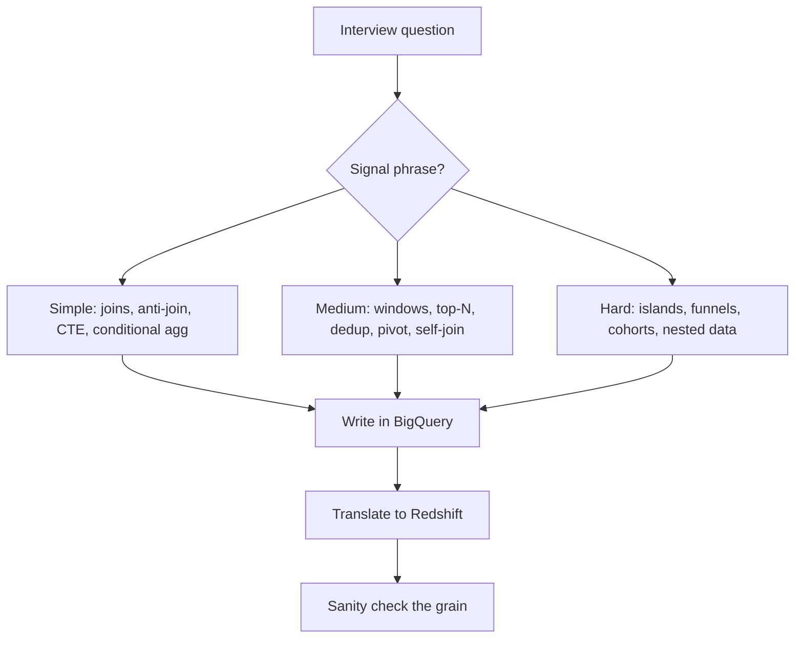


## The mindset (before any query)
1. **Grain first** — say out loud what one output row is: "one row per user per day".
2. **Plan out loud** — "filter to completed orders, group by week, then LAG".
3. **Build in pieces** — small CTEs, talk as you go.
4. **Check** — does the total reconcile? Any impossible values?
5. **Understand before coding** (1-2 min of questions), **talk while you work**, **prefer portable ANSI SQL**, **fewest table scans**.


## Signal phrase → pattern (cheat sheet)

| If the interviewer says… | Pattern | Section |
|---|---|---|
| "first / second / nth highest" | Window rank (`DENSE_RANK`) | 2.1 |
| "top N per group / in each department" | `ROW_NUMBER() OVER (PARTITION BY …)` | 2.4 |
| "rolling" / "cumulative" / "moving average" | Window frame (`ROWS BETWEEN`) | 2.3 |
| "compare to previous day / week-over-week" | `LAG` | 2.2 |
| "users who have no X / never did Y" | Anti-join (`LEFT JOIN … IS NULL`) | 1.2 |
| "count multiple things with a condition" | `COUNTIF` / `SUM(CASE WHEN)` | 1.4 |
| "X by country / metric by dimension" | `GROUP BY` | 1.1 |
| "deduplicate / keep the latest per key" | `QUALIFY ROW_NUMBER() = 1` | 2.5 |
| "consecutive / streak / find gaps" | Gaps-and-islands | 3.1 |
| "funnel / conversion path" | Conditional aggregation + CTE | 3.3 |
| "retention by signup cohort" | Cohort self-join | 3.4 |
| "nested / repeated fields" | `UNNEST` (BQ) / `SUPER` (RS) | 3.5 |


## 1. Simple patterns


### 1.1 Joins & grain

**What it is:** `JOIN` combines rows from two tables on a key. **Grain** = what one row of a table/result means (e.g. "one row per order line").

**Why it matters:** joining two tables at *different* grains double-counts rows. State the grain before you join.

| Join | Keeps |
|---|---|
| `INNER` | only rows that match in both |
| `LEFT` | all left rows + matches from right |
| `RIGHT` | all right rows + matches from left |
| `FULL OUTER` | all rows from both |

**Scenario (Amazon):** "Revenue by customer segment, *including* segments with zero orders."

```sql
-- BigQuery / Redshift / Snowflake (ANSI, identical)
SELECT
  s.segment,
  COALESCE(SUM(o.amount), 0) AS revenue
FROM segments s
LEFT JOIN orders o ON o.segment_id = s.id
GROUP BY s.segment;
```

**Output (revenue by segment, including zero-order segments):**

| segment | revenue |
|---|---|
| Premium | 1500 |
| Free | 0 |
| Basic | 800 |

**Watch out:** putting a filter on the *right* table in `WHERE` silently turns a `LEFT JOIN` into an `INNER JOIN`. Right-table filters go in the `ON` clause:

```sql
-- WRONG: drops segments with zero orders
LEFT JOIN orders o ON o.segment_id = s.id
WHERE o.status = 'paid'

-- RIGHT: keep the LEFT semantics
LEFT JOIN orders o ON o.segment_id = s.id AND o.status = 'paid'
```


### 1.2 Anti-join / "find missing"

**What it is:** rows that have **no match** in another table — "users who have no friends", "users who never ordered".

Three ways, in order of preference:

```sql
-- 1) BEST: LEFT JOIN + IS NULL (BigQuery / Redshift / Snowflake)
SELECT u.user_id
FROM users u
LEFT JOIN friends f ON u.user_id = f.user_id
WHERE f.user_id IS NULL;

-- 2) FAST: NOT EXISTS (short-circuits on first match)
SELECT u.user_id
FROM users u
WHERE NOT EXISTS (SELECT 1 FROM friends f WHERE f.user_id = u.user_id);

-- 3) AVOID: NOT IN (breaks if the subquery returns NULL)
SELECT user_id FROM users
WHERE user_id NOT IN (SELECT user_id FROM friends);
```

**Output (users with no friends):**

| user_id |
|---|
| 3 |
| 7 |

**Watch out:** `NOT IN` returns *no rows* if the subquery contains a `NULL`. Always prefer `NOT EXISTS` or `LEFT JOIN … IS NULL`.


### 1.3 CTEs (Common Table Expressions)

**What it is:** a `WITH` block = a named, temporary result you can reuse. It reads top-to-bottom and keeps big queries understandable.

```sql
-- BigQuery / Redshift / Snowflake (ANSI identical)
WITH daily AS (
    SELECT
        user_id,
        DATE(created_at) AS d,
        SUM(amount)      AS revenue
    FROM orders
    GROUP BY 1, 2
)
SELECT
    d,
    SUM(revenue) AS total
FROM daily
GROUP BY d
ORDER BY d;
```

**Output (one row per day):**

| d | total |
|---|---|
| 2024-01-01 | 1250 |
| 2024-01-02 | 980 |
| 2024-01-03 | 1500 |

**Why it matters:** prefer a `WITH` over a nested subquery — it keeps your thought process visible to the interviewer.


### 1.4 Conditional aggregation — KEY BigQuery → Redshift → Snowflake difference

**What it is:** count or sum rows that match a condition, all in **one pass** (one table scan).

**Scenario (Meta):** "How many users liked, shared, and commented in one query?"

```sql
-- BigQuery: COUNTIF
SELECT
  COUNTIF(event = 'like')    AS likes,
  COUNTIF(event = 'share')   AS shares,
  COUNTIF(event = 'comment') AS comments
FROM events;

-- Redshift: SUM(CASE WHEN ... THEN 1 ELSE 0 END)
SELECT
  SUM(CASE WHEN event = 'like'    THEN 1 ELSE 0 END) AS likes,
  SUM(CASE WHEN event = 'share'   THEN 1 ELSE 0 END) AS shares,
  SUM(CASE WHEN event = 'comment' THEN 1 ELSE 0 END) AS comments
FROM events;

-- Snowflake: COUNT_IF (or SUM(IFF(cond, 1, 0)))
SELECT
  COUNT_IF(event = 'like')    AS likes,
  COUNT_IF(event = 'share')   AS shares,
  COUNT_IF(event = 'comment') AS comments
FROM events;
```

**Output (one row, three counts):**

| likes | shares | comments |
|---|---|---|
| 1200 | 450 | 300 |

**Why it matters:** one scan beats three `WHERE event = … UNION ALL` scans (fewest table scans).

**Watch out:** BigQuery uses `COUNTIF`, Redshift uses `SUM(CASE WHEN …)`, Snowflake uses `COUNT_IF` (or `IFF`). Know all three.


## 2. Medium patterns


### 2.1 Window functions — ROW_NUMBER / RANK / DENSE_RANK

**What it is:** a **window function** computes over a set of rows ("window") without collapsing them, unlike `GROUP BY`. `PARTITION BY` splits the window into groups; `ORDER BY` sets the order inside each.

**The tie question** (scores `100, 100, 90, 80`):

| Function | Output | Meaning |
|---|---|---|
| `ROW_NUMBER()` | 1, 2, 3, 4 | always unique, no gaps |
| `RANK()` | 1, 1, 3, 4 | ties share rank, **skips** numbers |
| `DENSE_RANK()` | 1, 1, 2, 3 | ties share rank, **no gaps** |

**Scenario (Meta/Amazon classic):** "Second highest salary."

```sql
-- BigQuery / Redshift / Snowflake (DENSE_RANK handles ties correctly)
WITH ranked AS (
    SELECT
        salary,
        DENSE_RANK() OVER (ORDER BY salary DESC) AS rnk
    FROM employees
)
SELECT salary
FROM ranked
WHERE rnk = 2;

-- Alternative without a window (portable ANSI):
SELECT MAX(salary) AS second_highest
FROM employees
WHERE salary < (SELECT MAX(salary) FROM employees);
```

**Watch out:** use `DENSE_RANK` for "nth highest" (so two people tied at the top don't break "2nd"). Use `ROW_NUMBER` for a strict, unique pick (e.g. "top 1 per group").

**When to use each:**

| Function | Use it for | Example |
|---|---|---|
| `ROW_NUMBER()` | a **strict, unique** pick (no ties) | "top 1 per customer", "first purchase per user" |
| `RANK()` | ranking **with gaps** for ties | "top 3 salary *tiers*" — ties share rank, then skip |
| `DENSE_RANK()` | ranking **without gaps** | "n-th highest salary", "top 3 *distinct* values" |

**Example — `ROW_NUMBER()` (first purchase per customer):**

```sql
WITH ranked AS (
    SELECT
        *,
        ROW_NUMBER() OVER (PARTITION BY customer_id ORDER BY order_date) AS rn
    FROM orders
)
SELECT *
FROM ranked
WHERE rn = 1;
```

**Output (before filter → keep `rn = 1`):**

| customer_id | order_id | order_date | rn |
|---|---|---|---|
| 1 | 101 | 2024-01-05 | 1 |
| 1 | 102 | 2024-01-20 | 2 |
| 2 | 201 | 2024-02-01 | 1 |

*(keeps the first order per customer: rows 101 and 201)*

**Example — `RANK()` (top 3 salary tiers):**

```sql
SELECT
    name,
    salary,
    RANK() OVER (ORDER BY salary DESC) AS rnk
FROM employees
QUALIFY rnk <= 3;
```

**Output:**

| name | salary | rnk |
|---|---|---|
| Alice | 100 | 1 |
| Bob | 100 | 1 |
| Carol | 90 | 3 |

*(Alice and Bob tie for 1st, so the next rank is 3 — Carol is still in the top 3)*


### 2.2 LAG / LEAD (compare to previous / next)

**What it is:** `LAG(col)` = the value from the previous row; `LEAD(col)` = the next row. Use it for "day-over-day", "week-over-week", "compare to previous".

**Scenario (Spotify):** "Days where streams were higher than the previous day."

```sql
-- BigQuery / Redshift / Snowflake (ANSI identical)
WITH daily AS (
    SELECT
        DATE(listened_at) AS d,
        COUNT(*)         AS streams
    FROM listens
    GROUP BY 1
),
with_prev AS (
    SELECT
        d,
        streams,
        LAG(streams) OVER (ORDER BY d) AS prev_streams
    FROM daily
)
SELECT
    d,
    streams,
    prev_streams
FROM with_prev
WHERE streams > prev_streams;
```

**Output — the `with_prev` step (full sequence, shows the LAG):**

| `d` | `streams` | `prev_streams` |
|---|---|---|
| 2024-01-01 | 100 | NULL |
| 2024-01-02 | 150 | 100 |
| 2024-01-03 | 120 | 150 |
| 2024-01-04 | 205 | 120 |
| 2024-01-05 | 190 | 205 |

**Final result (`WHERE streams > prev_streams`):**

| `d` | `streams` | `prev_streams` |
|---|---|---|
| 2024-01-02 | 150 | 100 |
| 2024-01-04 | 205 | 120 |

**Watch out:** `LAG/LEAD` need a deterministic `ORDER BY`; otherwise rows are unordered and the result is wrong.


### 2.3 Running totals & moving averages

**What it is:** cumulative sums / rolling averages over a time series. Signal words: **"rolling", "cumulative", "moving average"**.

```sql
-- BigQuery / Redshift / Snowflake (ROWS frame is identical)
SELECT
  order_date,
  daily_revenue,
  SUM(daily_revenue) OVER (ORDER BY order_date
    ROWS BETWEEN UNBOUNDED PRECEDING AND CURRENT ROW) AS running_total,
  AVG(daily_revenue) OVER (ORDER BY order_date
    ROWS BETWEEN 6 PRECEDING AND CURRENT ROW) AS ma_7day
FROM daily_revenue;
```

**Output (8 days; `ma_7day` is a partial window until the 7th day):**

| order_date | daily_revenue | running_total | ma_7day |
|---|---|---|---|
| 2024-01-01 | 100 | 100 | 100.00 |
| 2024-01-02 | 150 | 250 | 125.00 |
| 2024-01-03 | 200 | 450 | 150.00 |
| 2024-01-04 | 50 | 500 | 125.00 |
| 2024-01-05 | 120 | 620 | 124.00 |
| 2024-01-06 | 180 | 800 | 133.33 |
| 2024-01-07 | 90 | 890 | 127.14 |
| 2024-01-08 | 210 | 1100 | 142.86 |

*(the 7-day window only fills completely from 2024-01-07; earlier rows average just the rows available — e.g. 2024-01-07 = (100+150+200+50+120+180+90) ÷ 7 = 127.14)*

**Watch out:** use `ROWS BETWEEN … PRECEDING AND CURRENT ROW` (not `RANGE`) for a *fixed number of rows*; `RANGE` groups ties and can give wrong rolling counts.


### 2.4 Top-N per group

**What it is:** "top 3 X *in each group*" — a `ROW_NUMBER()` partitioned by the group.

**Scenario (Amazon):** "Top 3 salaries per department."

```sql
-- BigQuery / Redshift / Snowflake
WITH ranked AS (
    SELECT
        department,
        employee_name,
        salary,
        ROW_NUMBER() OVER (PARTITION BY department ORDER BY salary DESC) AS rn
    FROM employees
)
SELECT
    department,
    employee_name,
    salary
FROM ranked
WHERE rn <= 3;
```

**Output (top 3 salaries per department):**

| department | employee_name | salary |
|---|---|---|
| Sales | Alice | 100 |
| Sales | Bob | 90 |
| Sales | Carol | 80 |
| Eng | Dave | 120 |
| Eng | Eve | 110 |

**Watch out:** to keep ties (two people with the same top salary), use `DENSE_RANK` and `<= 3`; to pick *exactly* N rows, use `ROW_NUMBER`.


### 2.5 Deduplication (keep latest / earliest per key)

**What it is:** one row per key, keeping the newest (or oldest) record.

**Scenario (Spotify):** "Keep each user's latest subscription status."

```sql
-- BigQuery / Redshift / Snowflake: all support QUALIFY
SELECT *
FROM subscriptions
QUALIFY ROW_NUMBER() OVER (PARTITION BY user_id ORDER BY updated_at DESC) = 1;

-- Portable version (works everywhere, incl. MySQL/Postgres):
WITH ranked AS (
    SELECT
        *,
        ROW_NUMBER() OVER (PARTITION BY user_id ORDER BY updated_at DESC) AS rn
    FROM subscriptions
)
SELECT *
FROM ranked
WHERE rn = 1;
```

**Output (one latest row per user):**

| user_id | subscription | updated_at |
|---|---|---|
| 1 | premium | 2024-01-15 |
| 2 | basic | 2024-01-10 |
| 3 | premium | 2024-01-20 |

**Watch out:** `QUALIFY` filters on a window function *after* it's computed — it's not in MySQL, so in a "basic MySQL" screener, fall back to the subquery version.


### 2.6 Pivot (CASE WHEN)

**What it is:** turn values in one column into columns. Manual pivot = conditional aggregation with `GROUP BY`.

**Scenario (Amazon):** "Monthly revenue per department, months as columns."

```sql
-- BigQuery / Redshift / Snowflake (manual pivot)
SELECT
  department,
  SUM(CASE WHEN month = 'Jan' THEN revenue ELSE 0 END) AS jan,
  SUM(CASE WHEN month = 'Feb' THEN revenue ELSE 0 END) AS feb,
  SUM(CASE WHEN month = 'Mar' THEN revenue ELSE 0 END) AS mar
FROM dept_revenue
GROUP BY department;
```

**Output (months as columns):**

| department | jan | feb | mar |
|---|---|---|---|
| Sales | 300 | 250 | 400 |
| Eng | 150 | 200 | 180 |

**BigQuery native `PIVOT` (same result, no `CASE WHEN` boilerplate):**

```sql
-- BigQuery native PIVOT
SELECT *
FROM dept_revenue
PIVOT(SUM(revenue) FOR month IN ('Jan', 'Feb', 'Mar'));
```

**Output (same as the manual version):**

| department | Jan | Feb | Mar |
|---|---|---|---|
| Sales | 300 | 250 | 400 |
| Eng | 150 | 200 | 180 |

*(column names are the pivot values themselves; add an aggregate alias — `PIVOT(SUM(revenue) AS revenue FOR …)` — to get `Jan_revenue`, `Feb_revenue`, `Mar_revenue`)*

**BigQuery native `UNPIVOT` (reverse: columns → rows):**

```sql
-- BigQuery native UNPIVOT (turn Jan/Feb/Mar columns back into month + revenue rows)
SELECT *
FROM dept_pivot
UNPIVOT(revenue FOR month IN (Jan, Feb, Mar));
```

**Output (back to long form):**

| department | month | revenue |
|---|---|---|
| Sales | Jan | 300 |
| Sales | Feb | 250 |
| Sales | Mar | 400 |
| Eng | Jan | 150 |
| Eng | Feb | 200 |
| Eng | Mar | 180 |

*(`UNPIVOT` drops `NULL`s by default; use `UNPIVOT INCLUDE NULLS (…)` to keep them)*

**Watch out:** a manual pivot needs one `CASE WHEN` per output column — know the distinct values up front (or generate SQL dynamically). Native `PIVOT`/`UNPIVOT` exist in **BigQuery** and **Snowflake** but **not Redshift** — Redshift = manual `CASE WHEN` only.


### 2.7 Self-join

**What it is:** join a table to *itself* (give it two aliases). Classic for "compare a row to a related row in the same table".

**Scenario (Amazon):** "Employees earning more than their manager."

```sql
-- BigQuery / Redshift / Snowflake
SELECT e.name AS employee
FROM employee e
JOIN employee m ON e.manager_id = m.id
WHERE e.salary > m.salary;
```

**Output (employees earning more than their manager):**

| employee |
|---|
| Alice |
| Carol |

**Watch out:** a self-join can *also* replicate `LAG/LEAD` (join on the previous key) — some teams demand pure ANSI SQL, so know this trick:

```sql
-- LAG/LEAD equivalent via self-join (portable ANSI)
SELECT
    a.d,
    a.value - b.value AS day_over_day
FROM daily a
LEFT JOIN daily b ON b.d = DATE_SUB(a.d, INTERVAL 1 DAY);
```


### 2.8 Approximate distinct count

**What it is:** a fast, *approximate* `COUNT(DISTINCT …)` for huge tables. Slightly imprecise, much cheaper.

```sql
-- BigQuery
SELECT APPROX_COUNT_DISTINCT(user_id) AS approx_users
FROM events;

-- Redshift
SELECT APPROXIMATE COUNT(DISTINCT user_id) AS approx_users
FROM events;

-- Snowflake (same function name as BigQuery)
SELECT APPROX_COUNT_DISTINCT(user_id) AS approx_users
FROM events;
```

**Output (approximate, single value):**

| approx_users |
|---|
| 9,998,412 |

**Watch out:** use it for exploratory/trend numbers, never for exact reconciliation or billing.


### 2.9 Plain "top N rows" — LIMIT / TOP / FETCH FIRST

**What it is:** the simplest "give me the top N rows" — no window function, just `ORDER BY` + a row limit. Returns **exactly N rows** (ties broken arbitrarily).

| Dialect | Syntax |
|---|---|
| BigQuery | `ORDER BY x DESC LIMIT 5` |
| Redshift | `ORDER BY x DESC LIMIT 5` |
| Snowflake | `ORDER BY x DESC LIMIT 5` (also `FETCH FIRST 5 ROWS ONLY`, `TOP 5`) |
| SQL Server | `SELECT TOP 5 … ORDER BY x DESC` |

```sql
SELECT
    order_id,
    amount
FROM orders
ORDER BY amount DESC
LIMIT 5;
```

**Output (top 5 by amount):**

| order_id | amount |
|---|---|
| 9 | 500 |
| 3 | 450 |
| 7 | 400 |
| 1 | 350 |
| 5 | 300 |

**When to use what:**

| Approach | Returns | Use when |
|---|---|---|
| `LIMIT 5` | exactly 5 rows, ties arbitrary | quick "top 5", ties don't matter |
| `ROW_NUMBER() <= 5` | exactly 5 rows, deterministic | strict, repeatable pick |
| `DENSE_RANK() <= 5` | top 5 *distinct* values | "top 5 scores" with ties |
| `RANK() <= 5` | top 5 with gaps | Olympic-style ranking |


## 3. Hard patterns


### 3.1 Gaps-and-islands

**What it is:** group *consecutive* values into "islands" (runs) and find "gaps" between them. The trick: subtract a `ROW_NUMBER()` from the value — consecutive values get the **same** group id.

**Scenario (Cinema, LeetCode):** "Find all blocks of 2+ consecutive free seats."

```sql
-- BigQuery / Redshift / Snowflake (integer arithmetic, identical)
WITH numbered AS (
  SELECT seat_id,
         seat_id - ROW_NUMBER() OVER (ORDER BY seat_id) AS grp
  FROM cinema
  WHERE free = 1
)
SELECT
    grp,
    MIN(seat_id) AS start_seat,
    MAX(seat_id) AS end_seat,
    COUNT(*)     AS consecutive
FROM numbered
GROUP BY grp
HAVING COUNT(*) >= 2;
```

**Scenario (gaming, dates):** "Player sessions — a new session starts after 30 min of inactivity."

```sql
-- BigQuery (timestamp diff)
-- Redshift/Snowflake use DATEDIFF(minute, prev_ts, event_timestamp) instead of TIMESTAMP_DIFF
WITH flagged AS (
  SELECT user_id, event_timestamp,
         LAG(event_timestamp) OVER (PARTITION BY user_id ORDER BY event_timestamp) AS prev_ts
  FROM raw_events
)
SELECT user_id, event_timestamp,
       SUM(CASE WHEN prev_ts IS NULL OR TIMESTAMP_DIFF(event_timestamp, prev_ts, MINUTE) > 30
                THEN 1 ELSE 0 END)
         OVER (PARTITION BY user_id ORDER BY event_timestamp) AS session_id
FROM flagged;
```

**Output (blocks of 2+ consecutive free seats; `grp` is the internal group id):**

| grp | start_seat | end_seat | consecutive |
|---|---|---|---|
| 0 | 1 | 3 | 3 |
| 3 | 7 | 8 | 2 |

**Watch out:** the subtract-`ROW_NUMBER` trick needs a stable sort; ties/duplicates break the grouping.


### 3.2 Consecutive sequences

**What it is:** find values that repeat N times in a row (using `LAG` twice).

**Scenario (LeetCode 180):** "Numbers that appear 3 times consecutively."

```sql
-- BigQuery / Redshift / Snowflake
WITH c AS (
  SELECT num,
         LAG(num, 1) OVER (ORDER BY id) AS prev1,
         LAG(num, 2) OVER (ORDER BY id) AS prev2
  FROM logs
)
SELECT DISTINCT num
FROM c
WHERE num = prev1 AND num = prev2;
```


**Output (numbers appearing 3× consecutively):**

| num |
|---|
| 1 |
| 3 |


### 3.3 Funnel analysis

**What it is:** measure how many users move step-by-step through a path (view → cart → purchase).

**Scenario (Netflix/Spotify):** "Funnel: viewed → added to cart → purchased."

```sql
-- BigQuery (IF + COUNTIF)
WITH steps AS (
  SELECT user_id,
         MIN(IF(event = 'view',     ts, NULL)) AS view_ts,
         MIN(IF(event = 'cart',     ts, NULL)) AS cart_ts,
         MIN(IF(event = 'purchase', ts, NULL)) AS purchase_ts
  FROM events
  GROUP BY user_id
)
SELECT
  COUNTIF(view_ts     IS NOT NULL) AS viewed,
  COUNTIF(cart_ts     IS NOT NULL AND cart_ts     > view_ts) AS added_to_cart,
  COUNTIF(purchase_ts IS NOT NULL AND purchase_ts > cart_ts) AS purchased
FROM steps;

-- Redshift (CASE WHEN + SUM)
WITH steps AS (
  SELECT user_id,
         MIN(CASE WHEN event = 'view'     THEN ts END) AS view_ts,
         MIN(CASE WHEN event = 'cart'     THEN ts END) AS cart_ts,
         MIN(CASE WHEN event = 'purchase' THEN ts END) AS purchase_ts
  FROM events
  GROUP BY user_id
)
SELECT
  SUM(CASE WHEN view_ts     IS NOT NULL THEN 1 ELSE 0 END) AS viewed,
  SUM(CASE WHEN cart_ts     IS NOT NULL AND cart_ts     > view_ts THEN 1 ELSE 0 END) AS added_to_cart,
  SUM(CASE WHEN purchase_ts IS NOT NULL AND purchase_ts > cart_ts THEN 1 ELSE 0 END) AS purchased
FROM steps;

-- Snowflake (IFF + COUNT_IF)
WITH steps AS (
  SELECT user_id,
         MIN(IFF(event = 'view',     ts, NULL)) AS view_ts,
         MIN(IFF(event = 'cart',     ts, NULL)) AS cart_ts,
         MIN(IFF(event = 'purchase', ts, NULL)) AS purchase_ts
  FROM events
  GROUP BY user_id
)
SELECT
  COUNT_IF(view_ts     IS NOT NULL) AS viewed,
  COUNT_IF(cart_ts     IS NOT NULL AND cart_ts     > view_ts) AS added_to_cart,
  COUNT_IF(purchase_ts IS NOT NULL AND purchase_ts > cart_ts) AS purchased
FROM steps;
```

**Output (funnel counts):**

| viewed | added_to_cart | purchased |
|---|---|---|
| 10000 | 3500 | 1200 |

**Watch out:** a *sequential* funnel requires timestamps to be ordered (step N after step N-1), not just present.


### 3.4 Cohort / retention analysis

**What it is:** group users by signup month, then measure how many stay active in later months.

**Scenario (Spotify):** "Monthly retention by signup cohort."

```sql
-- BigQuery
WITH cohorts AS (
  SELECT user_id, DATE_TRUNC(signup_date, MONTH) AS cohort
  FROM users
),
activity AS (
  SELECT user_id, DATE_TRUNC(activity_date, MONTH) AS act_month
  FROM events
  GROUP BY 1, 2
)
SELECT c.cohort,
       DATE_DIFF(a.act_month, c.cohort, MONTH) AS month_num,
       COUNT(DISTINCT a.user_id) AS active_users
FROM cohorts c
JOIN activity a USING (user_id)
GROUP BY 1, 2
ORDER BY 1, 2;

-- Redshift/Snowflake: two differences (identical syntax)
--   DATE_TRUNC('month', signup_date)   (quoted unit, not MONTH)
--   DATEDIFF(month, c.cohort, a.act_month)  (part first)
```

**Output (cohort × month retention):**

| cohort | month_num | active_users |
|---|---|---|
| 2024-01 | 0 | 500 |
| 2024-01 | 1 | 320 |
| 2024-01 | 2 | 210 |
| 2024-02 | 0 | 480 |
| 2024-02 | 1 | 300 |

**Watch out:** `DATE_TRUNC` syntax differs — BigQuery `DATE_TRUNC(d, MONTH)`, Redshift/Snowflake `DATE_TRUNC('month', d)`. And `DATE_DIFF(a, b, X)` (BQ) = `DATEDIFF(x, b, a)` (Redshift/Snowflake).


### 3.5 Nested data — ARRAY/STRUCT (UNNEST) → SUPER/JSON → VARIANT/FLATTEN

**What it is:** a column can hold a list (`ARRAY`) or object (`STRUCT`) in BigQuery; Redshift stores these in a `SUPER` column; Snowflake in a `VARIANT`/`ARRAY`/`OBJECT` column.

```sql
-- BigQuery: flatten an array with UNNEST
SELECT
    t.user_id,
    item.product,
    item.price
FROM transactions t
CROSS JOIN UNNEST(t.items) AS item;

-- Redshift: SUPER type + PartiQL (comma-join flattens the array)
SELECT
    t.user_id,
    item.product,
    item.price
FROM transactions t, t.items AS item;

-- Redshift: JSON path extraction (from a SUPER/JSON column)
SELECT JSON_EXTRACT_PATH_TEXT(JSON_SERIALIZE(payload), 'user_id') AS user_id
FROM staging.raw_telemetry;

-- Snowflake: VARIANT/ARRAY + LATERAL FLATTEN
SELECT
    t.user_id,
    f.value:product::STRING AS product,
    f.value:price::NUMBER  AS price
FROM transactions t,
LATERAL FLATTEN(input => t.items) f;

-- Snowflake: colon accessor (or GET) for JSON path
SELECT payload:user_id::STRING AS user_id
FROM staging.raw_telemetry;
```

**Output (one row per item after flatten):**

| user_id | product | price |
|---|---|---|
| 1 | Book | 15 |
| 1 | Pen | 3 |
| 2 | Mug | 10 |

**Watch out:** BigQuery flattens with `UNNEST`; Redshift flattens a `SUPER` array with a comma-join (PartiQL); Snowflake flattens a `VARIANT`/`ARRAY` with `FLATTEN`.


### 3.6 Complex multi-step (nested CTEs)

**What it is:** chain several CTEs, one logical step per CTE, filtering/aggregating before each join.

```sql
-- BigQuery / Redshift / Snowflake (pattern, not syntax)
WITH filtered AS (
  SELECT * FROM orders WHERE order_date >= '2026-01-01'   -- filter early
),
user_totals AS (
  SELECT user_id, SUM(amount) AS total
  FROM filtered
  GROUP BY user_id                                        -- aggregate before join
)
SELECT
    c.country,
    COUNT(r.user_id) AS buyers,
    SUM(r.total)     AS revenue
FROM user_totals r
JOIN customers c ON c.user_id = r.user_id                 -- co-located join
GROUP BY c.country;
```

**Output (buyers + revenue by country):**

| country | buyers | revenue |
|---|---|---|
| US | 120 | 5400 |
| CA | 45 | 2100 |
| UK | 30 | 1500 |

**Watch out:** keep each CTE **single-purpose** — this is also how you hand readable, testable SQL to an AI agent or reviewer.


## 4. Optimization (onsite-style)

Your 90-min round is **onsite-style**: expect table scans, `EXPLAIN`, and physical-design questions — not just "write the query".


### 4.1 Fewest table scans

**Rule:** solve the question with the **minimum number of passes** over the table.

```sql
-- One scan (good): conditional aggregation
SELECT
  COUNT(CASE WHEN status = 'completed' THEN 1 END) AS completed,
  COUNT(CASE WHEN status = 'refunded'  THEN 1 END) AS refunded
FROM orders;

-- Two scans (avoid): UNION ALL forces a second read
SELECT COUNT(*) FROM orders WHERE status = 'completed'
UNION ALL
SELECT COUNT(*) FROM orders WHERE status = 'refunded';
```


**Output (one scan):**

| completed | refunded |
|---|---|
| 850 | 60 |


### 4.2 Query plans & cost (`EXPLAIN` / `--dry_run`)

**What it is:** before tuning, see *how* the database executes a query and *where the cost is* — without running it.

**BigQuery — bytes scanned is the #1 cost lever:**
- `bq query --dry_run` → estimates **bytes scanned** before you run (the cost driver).
- The console **Execution details** graph → stages, shuffle, and per-stage slot time.
- `INFORMATION_SCHEMA.JOBS_BY_PROJECT` → `total_bytes_processed`, `total_slot_ms` for runs that already happened.

**The BigQuery tuning sequence (4 steps):**
1. `--dry_run` → confirm the bytes scanned.
2. Filter on the **partition / cluster** columns so BigQuery prunes (fewer bytes = cheaper + faster).
3. Select **only the columns you need** — `SELECT *` reads every column.
4. Avoid **cross joins** / cartesian products (they explode bytes).

**Redshift — `EXPLAIN` + system views:**
- `svl_query_report` — per-step rows, bytes, `is_diskbased` (spilled to disk).
- `stl_explain` — the plan; watch for `DS_DIST_INNER` / `DS_DIST_ALL_NONE` (data reshuffled across nodes = bad).

**The Redshift tuning sequence (4 steps):**
1. `svl_query_report` → find `is_diskbased = true` or huge `output_bytes` (the bottleneck).
2. `stl_explain` → find `DS_DIST_*` steps (network shuffle).
3. Check the `SORTKEY` column is used in `WHERE`; run `ANALYZE <table>`.
4. Refactor CTEs to filter/aggregate *before* joining.

**Snowflake —** `EXPLAIN` + `QUERY_HISTORY` (see the Appendix dialect map).


### 4.3 Physical design — the BigQuery → Redshift → Snowflake shift

**BigQuery** auto-manages storage (serverless, no `VACUUM`/indexes), but you steer it with **partitioning + clustering** to prune reads:

```sql
-- BigQuery: partition by date + cluster by user to prune reads
CREATE TABLE fact_orders (
  order_id  INT64 NOT NULL,
  user_id   INT64 NOT NULL,
  amount    NUMERIC,
  order_ts  TIMESTAMP NOT NULL
)
PARTITION BY DATE(order_ts)
CLUSTER BY user_id;
```

**Redshift** needs you to set physical layout manually:

| Term | Definition (plain English) |
|---|---|
| `DISTKEY` | the column Redshift uses to decide **which node** stores a row — set it on the join column so joined rows live on the same node (no network shuffle) |
| `SORTKEY` | orders rows **on disk** so Redshift can skip blocks it doesn't need (block pruning) — set it on the time column you filter on |
| `DISTSTYLE` | how rows are spread: `KEY` (by DISTKEY), `EVEN` (round-robin), `ALL` (copy small dim to every node) |
| `VACUUM` / `ANALYZE` | housekeeping: `VACUUM` reclaims space + re-sorts, `ANALYZE` refreshes stats for the planner |

```sql
-- Redshift: create a fact table tuned for user joins + date filters
CREATE TABLE fact_orders (
  order_id  BIGINT NOT NULL,
  user_id   BIGINT NOT NULL DISTKEY,   -- co-locate by user
  amount    DECIMAL(18,2),
  order_ts  TIMESTAMP NOT NULL SORTKEY -- prune by date
);

ANALYZE fact_orders;
VACUUM SORT ONLY fact_orders;
```

**Redshift has no B-tree indexes.** "Add an index" is the wrong answer — the Redshift answer is "set DISTKEY/SORTKEY and ANALYZE/VACUUM".

**Snowflake** auto-manages storage in **micro-partitions** — there is no `DISTKEY`/`SORTKEY` and no `VACUUM`/`ANALYZE`. Instead, optionally define a **clustering key** on the columns you filter/join on (Snowflake re-clusters automatically):

```sql
CREATE TABLE fact_orders (...) CLUSTER BY (user_id, order_date);
```

### 4.4 BigQuery cost-optimization techniques (cheat sheet)

**The single biggest lever: reduce bytes scanned.** Every technique below is a way to shrink the data BigQuery has to read, move (shuffle), or re-read.

**A. Scan less data**

| Technique | Plain English |
|---|---|
| Filter early | Push `WHERE` filters into the earliest CTEs — the shuffle (moving rows between slots) is the most expensive part, so shrink row count up front. |
| Static partition pruning | Filter the partition column with a *constant* (or `_TABLE_SUFFIX` / a `SELECT MIN()` scalar), not a value discovered by a `JOIN`. Join-determined filters stop BigQuery from skipping blocks. |
| Keep columns "naked" | Don't wrap a column in a function in `WHERE` (e.g. `WHERE CAST(ts AS DATE) = …`) — it forces a full scan. Apply the function to the *parameter*, not the column. |
| Select only needed columns / drop useless joins | `SELECT *` reads every column; drop joins to tables whose columns you don't actually use (a join can also change row counts). |

**B. Scan fewer times**

| Technique | Plain English |
|---|---|
| Consolidate repeated table access | Pull several metrics in **one** scan with `COUNTIF` / conditional aggregation instead of `SELECT`-ing the same table multiple times. |
| `GROUPING SETS` over `UNION ALL` | One scan for many aggregation levels; `UNION ALL` re-reads the data once per branch. |
| Window functions over self-joins | `ROW_NUMBER()` / `LEAD` / `LAG` / `RANK` do it in a single pass; a self-join (e.g. `MAX + GROUP BY`, or `JOIN ON <=`) reads the data twice. |

**C. Cheaper joins**

| Technique | Plain English |
|---|---|
| Aggregate / dedupe before joining | Reduce to the target grain before the join so fewer keys get shuffled. |
| Avoid cartesian (cross) joins | `A × B` explodes row counts → "Resources Exceeded" / "Timeout" + massive slot usage. |

**D. Control CTE materialization**

| Technique | Plain English |
|---|---|
| Use a `TEMP TABLE` for heavy/reused CTEs | BigQuery does **not** cache non-recursive CTEs — each reference re-executes it. Materialize complex logic once into a `TEMPORARY TABLE`. |

**E. Pipeline-level (not one query)**

| Technique | Plain English |
|---|---|
| Incremental loads | Process only the delta (new/changed rows) instead of full refreshes; the KPI is *slot-milliseconds*. |
| Split backfills into batches | Massive multi-year backfills in one query cause `timeout` / `resourcesExceeded`; batch them. |
| Avoid Jinja/dynamic-SQL redundancy | A loop repeating a block 10× compiles into a 1,000-line wall of duplicated SQL — keep generated code DRY. |

*(§4.2 is the process — this is the catalog.)*

### 4.5 Recursive CTE (advanced)

**What it is:** a `WITH RECURSIVE` CTE that references *itself* to walk hierarchical or graph data (org chart, bill-of-materials, tree paths). It has an **anchor** (seed rows) plus a **recursive** member joined back to itself, combined with `UNION ALL`.

**Example (BigQuery — org chart, CEO down):**

```sql
WITH RECURSIVE org AS (
  -- anchor (base case): the CEO
  SELECT id, name, manager_id, 0 AS depth
  FROM employees
  WHERE manager_id IS NULL

  UNION ALL

  -- recursive step: each person's direct reports, one level deeper
  SELECT e.id, e.name, e.manager_id, org.depth + 1
  FROM employees e
  JOIN org ON e.manager_id = org.id
)
SELECT id, name, depth
FROM org
ORDER BY depth, id;
```

**Output (partial):**

| id | name | depth |
|---|---|---|
| 1 | Alice | 0 |
| 2 | Bob | 1 |
| 3 | Carol | 1 |
| 4 | Dave | 2 |

**Benefits:**

- Traverses a hierarchy in **one query** — no procedural loops, no guessing the max depth.
- BigQuery **materializes** recursive CTE results (unlike non-recursive CTEs), so the result is computed **once** — cheaper if referenced repeatedly.
- Replaces N self-joins that re-scan the table and must know depth in advance.

**Watch out:** use `UNION ALL` (not `UNION DISTINCT`); add a termination condition — BigQuery caps recursion depth (default 100, configurable).

---


## Appendix: Dialect map (BigQuery → Redshift → Snowflake)

| Concept | BigQuery | Redshift | Snowflake |
|---|---|---|---|
| Conditional count | `COUNTIF(cond)` | `SUM(CASE WHEN cond THEN 1 ELSE 0 END)` | `COUNT_IF(cond)` |
| Conditional value | `IF(cond, a, b)` | `CASE WHEN cond THEN a ELSE b END` | `IFF(cond, a, b)` |
| Approx distinct | `APPROX_COUNT_DISTINCT(x)` | `APPROXIMATE COUNT(DISTINCT x)` | `APPROX_COUNT_DISTINCT(x)` |
| String aggregate | `STRING_AGG(x ORDER BY x)` | `LISTAGG(x, ', ') WITHIN GROUP (ORDER BY x)` | `LISTAGG(x, ', ') WITHIN GROUP (ORDER BY x)` |
| Nested data | `ARRAY` / `STRUCT` + `UNNEST` | `SUPER` + PartiQL comma-join / `JSON_EXTRACT_PATH_TEXT` | `VARIANT` / `ARRAY` / `OBJECT` + `FLATTEN` |
| Dedup filter | `QUALIFY ROW_NUMBER() … = 1` | `QUALIFY ROW_NUMBER() … = 1` | `QUALIFY ROW_NUMBER() … = 1` |
| Date truncate | `DATE_TRUNC(d, MONTH)` | `DATE_TRUNC('month', d)` | `DATE_TRUNC('month', d)` |
| Date add | `DATE_ADD(d, INTERVAL 7 DAY)` | `DATEADD(day, 7, d)` | `DATEADD(day, 7, d)` |
| Date diff | `DATE_DIFF(a, b, DAY)` | `DATEDIFF(day, b, a)` | `DATEDIFF(day, a, b)` |
| Timestamp diff | `TIMESTAMP_DIFF(a, b, MINUTE)` | `DATEDIFF(minute, b, a)` | `DATEDIFF(minute, a, b)` |
| Query plan | `bq query --dry_run` | `EXPLAIN` + `svl_query_report` / `stl_explain` | `EXPLAIN` + `QUERY_HISTORY` |

---


## Practice checklist (from the 20 SQL questions)

- [ ] INNER vs LEFT vs FULL OUTER JOIN — say the difference out loud (1.1)
- [ ] Find duplicate rows; keep latest per key (2.5)
- [ ] Second/nth highest salary (2.1)
- [ ] RANK vs DENSE_RANK vs ROW_NUMBER ties (2.1)
- [ ] Pivot without PIVOT (2.6)
- [ ] EXPLAIN / query plan (4.2)
- [ ] Optimize a slow multi-join query (4.1, 4.3)
- [ ] HAVING vs WHERE (filter after vs before aggregation)
- [ ] NULLs in aggregation (COUNT skips NULLs; SUM of NULLs = NULL)
- [ ] Moving average (2.3)
- [ ] Top 3 per region (2.4)
- [ ] Correlated subquery vs regular subquery
- [ ] JOIN vs UNION (2.6)
- [ ] DELETE vs TRUNCATE vs DROP
- [ ] Detect outliers in SQL (e.g. values beyond N stddevs via window/percentiles)


## 5. dbt

**What it is:** dbt ("data build tool") turns your SQL files into tested, documented models in the warehouse. You write `SELECT` statements; dbt builds the tables/views and runs them in the right order.

**How it works (the loop):**

1. **Write SQL** — you write `SELECT` statements in `.sql` files.
2. **Run dbt** — dbt reads your code, builds the DAG, and runs SQL in order.
3. **Transform** — SQL runs in the warehouse; data is transformed.
4. **Test & validate** — dbt runs tests to check quality and consistency.
5. **Analyze & use** — trusted data is ready for BI tools and dashboards.

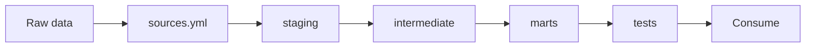

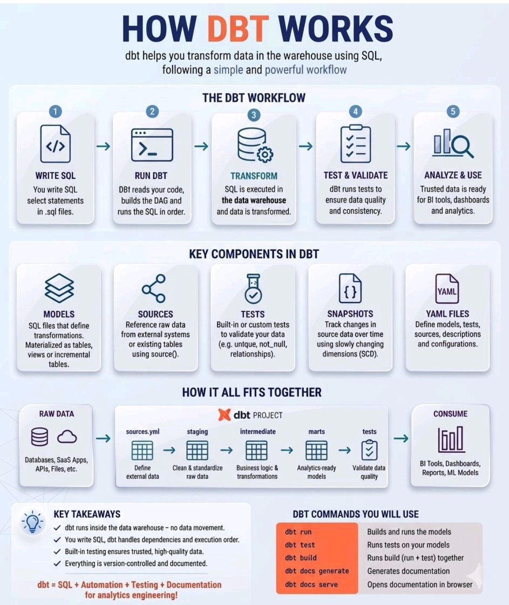

### 5.1 Install & setup (macOS + `uv`)

`uv` is a fast Python + package + virtual-environment manager (replaces `pip` + `venv` + `pyenv`).

| Step | Command | What it does |
|---|---|---|
| Prereq: git | `xcode-select --install` | Install command-line tools (includes git) |
| Prereq: Homebrew | `/bin/bash -c "$(curl -fsSL https://raw.githubusercontent.com/Homebrew/install/HEAD/install.sh)"` | Package manager for macOS |
| Install uv | `brew install uv` | Install the Python/env manager |
| Install Python | `uv python install 3.11` | Install a Python version (uv-managed) |
| Create env | `uv venv` | Create a `.venv/` folder for this project |
| Activate | `source .venv/bin/activate` | Enter the environment (macOS/Linux) |
| Install dbt (BigQuery) | `uv pip install dbt-bigquery` | dbt + BigQuery adapter |
| Install dbt (Redshift) | `uv pip install dbt-redshift` | dbt + Redshift adapter |
| Install dbt (Snowflake) | `uv pip install dbt-snowflake` | dbt + Snowflake adapter |
| Quality tools | `uv pip install dbt-checkpoint pre-commit sqlfluff sqlfluff-templater-dbt yamllint` | Lint + git hooks |
| Init project | `dbt init my_project` | Scaffold `dbt_project.yml`, `models/`, `macros/`, `seeds/` |

**Watch out:** `source .venv/bin/activate` is macOS/Linux. Windows uses `.venv\Scripts\activate`.

**Connection — `~/.dbt/profiles.yml`:**

```yaml
# --- BigQuery ---
my_bq:
  target: dev
  outputs:
    dev:
      type: bigquery
      method: oauth           # or: service-account
      project: my-project
      dataset: my_dataset
      location: US
      threads: 4

# --- Redshift ---
my_rs:
  target: dev
  outputs:
    dev:
      type: redshift
      host: my-cluster.redshift.amazonaws.com
      port: 5439
      user: my_user
      password: "{{ env_var('DBT_RS_PASSWORD') }}"
      dbname: my_db
      schema: my_schema
      threads: 4

# --- Snowflake ---
my_sf:
  target: dev
  outputs:
    dev:
      type: snowflake
      account: my_account.us-east-1
      user: my_user
      password: "{{ env_var('DBT_SF_PASSWORD') }}"
      role: my_role
      warehouse: my_warehouse
      database: my_db
      schema: my_schema
      threads: 4
```

**Verify it works:**

```
dbt --version       # is dbt installed?
dbt debug           # does the connection work?
dbt deps            # install packages (e.g. dbt_utils)
dbt build           # run + test everything
pre-commit install  # set up git hooks
```

### 5.2 dbt commands (cheat sheet)

| Command | How to run | What it does (plain English) |
|---|---|---|
| `init` | `dbt init <name>` | Create a new dbt project skeleton |
| `debug` | `dbt debug` | Test the warehouse connection |
| `deps` | `dbt deps` | Install packages listed in `packages.yml` |
| `parse` | `dbt parse` | Validate the project compiles (no DB access) |
| `list` | `dbt list` / `dbt ls` | List models / tests / sources |
| `seed` | `dbt seed` | Load CSV files from `seeds/` into the warehouse |
| `run` | `dbt run` | Build the models (tables / views) |
| `test` | `dbt test` | Run the tests defined in YAML |
| `build` | `dbt build` | `run` + `test` + `seed` + `snapshot` in one |
| `compile` | `dbt compile` | Write the compiled SQL to `target/` without running |
| `snapshot` | `dbt snapshot` | Build SCD2 snapshot tables |
| `run-operation` | `dbt run-operation <macro>` | Run a macro |
| `show` | `dbt show -s <model>` | Preview the rows a model returns |
| `source freshness` | `dbt source freshness` | Check if sources are stale |
| `docs generate` | `dbt docs generate` | Build the docs site |
| `docs serve` | `dbt docs serve` | Open docs locally in a browser |
| `clean` | `dbt clean` | Delete `target/` and `dbt_packages/` |
| `retry` | `dbt retry` | Re-run only what failed last time |

**Selectors** (run a subset):

| Selector | Example | Meaning |
|---|---|---|
| `-s` | `dbt run -s stg_orders` | Select one model |
| `+model` | `dbt run -s +stg_orders` | The model + everything **upstream** (parents) |
| `model+` | `dbt run -s stg_orders+` | The model + everything **downstream** (children) |
| `+model+` | `dbt run -s +stg_orders+` | The model + both directions |
| `@model` | `dbt run -s @stg_orders` | Model + downstream + their upstream |
| `2+model` | `dbt run -s 2+stg_orders` | Limit to 2 levels upstream |
| `tag:name` | `dbt run -s tag:staging` | All resources with a tag |
| `path:dir/` | `dbt run -s path:models/staging/` | All resources under a path |
| `resource_type:` | `dbt build --exclude resource_type:seed` | Filter by node type |
| `--exclude` | `dbt run --exclude stg_*` | Run everything except a pattern |
| `state:modified` | `dbt run -s state:modified+ --defer --state prod/` | Only what changed (Slim CI), defer unchanged refs |

**A few more useful flags:**

| Command | What it does |
|---|---|
| `dbt build --full-refresh` | Force incremental models to rebuild from scratch |
| `dbt build --vars '{start_date: 2024-01-01}'` | Pass run-time variables |
| `dbt run-operation grant_select --args '{role: bi}'` | Run a macro standalone (grants, admin SQL) |

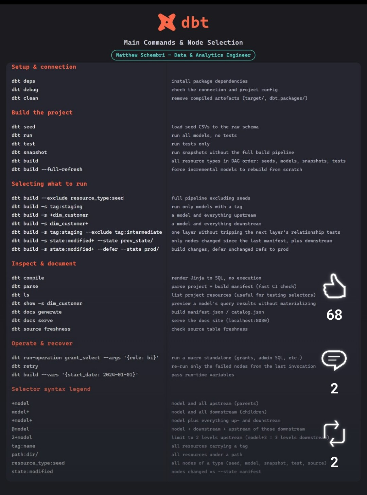

### 5.3 Git / terminal workflow

**What it is:** the branch → commit → push → rebase loop you use daily.

| Task | Command | Plain English |
|---|---|---|
| Get latest from remote | `git fetch origin` | Download changes without merging |
| Update your `main` | `git checkout main && git pull` | Switch to main and fast-forward it |
| New branch (with JIRA) | `git checkout -b ABC-123-add-orders-model` | Create + switch to a feature branch named with the ticket |
| See what changed | `git status` / `git diff` | List / show uncommitted changes |
| Stage files | `git add dbt/models/...` or `git add .` | Mark files to commit |
| Commit | `git commit -m "ABC-123: add stg_orders"` | Save a snapshot with a message |
| First push | `git push -u origin ABC-123-add-orders-model` | Upload the branch and track it |
| Rebase onto main | `git rebase main` | Replay your commits on top of the latest main |
| Squash commits | `git rebase -i HEAD~3` | Combine / edit the last 3 commits |
| Safe force-push | `git push --force-with-lease` | Overwrite remote **only if** nobody else pushed |
| Stash | `git stash` / `git stash pop` | Temporarily set aside / restore changes |
| Undo last commit | `git reset --soft HEAD~1` | Undo a commit but keep the changes staged |
| Discard a file | `git checkout -- <file>` | Throw away a file's uncommitted changes |

**Watch out:** avoid plain `git push --force` (can overwrite teammates' work). Use `git push --force-with-lease` — it refuses if the remote changed since you last fetched.

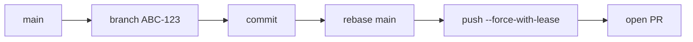

### 5.4 Model layers

**What it is:** dbt models are organized into layers. Data flows left → right, each layer adding cleanliness and meaning.

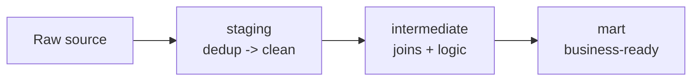

| Layer | Prefix | What it does | Materialized as |
|---|---|---|---|
| Staging (dedup) | `stg_<source>_<entity>s_dedup` | 1:1 with raw source; remove duplicate rows | `view` |
| Staging (clean) | `stg_<source>_<entity>s` | Rename columns, cast types, surrogate key | `incremental` |
| Intermediate | `int_<thing>` | Joins + business logic across staging models | `ephemeral` / `view` |
| Mart | `<business_name>` | Business-ready tables for BI tools | `table` / `incremental` |

**Naming (new guidelines):** do **not** use `dim_` / `fct_` prefixes. Marts are named by business purpose (e.g. `orders`, `customer_segments`), not by technical type.

**Surrogate key:** a single column that uniquely identifies a row, built from the natural keys:

```sql
{{ dbt_utils.generate_surrogate_key(['user_id', 'order_id']) }} AS _key_order
```

### 5.5 YAML (sources + models)

**`sources.yml`** — declare where raw data comes from:

```yaml
version: 2

sources:
  - name: raw_orders
    database: my-project      # BigQuery project (or Redshift db)
    schema: raw
    tables:
      - name: orders
        loaded_at_field: ingested_at   # enables freshness checks
```

**Model `schema.yml`** — describe + test each model:

```yaml
version: 2

models:
  - name: stg_orders
    description: >
      Staging model for raw order data.
      One row per order.
    columns:
      - name: _key_order
        description: Surrogate primary key.
        tests:
          - not_null
          - unique

      - name: order_id
        description: Source order identifier.
        tests:
          - not_null

      - name: amount_dollars
        description: Order amount rounded to 2 decimals.
```

**Rules (from your team conventions):** `version: 2` at the top; minimum **2 tests per model**; primary key always has `not_null` + `unique`; blank line between every column block; descriptions ≤ 150 chars per line (else use `>` folded style).

**`` blocks (optional — for shared or long descriptions):** when the same column appears in many models, or a description is long, define it **once** in a co-located `.md` file and reference it, instead of repeating the text in every model.

```markdown
<!-- _orders.md -->

Unique identifier for an order. This is the grain for all order models.

```

```yaml
# schema.yml
columns:
  - name: order_id
    description: '{{ doc("col_order_id") }}'
    tests:
      - not_null
      - unique
```

**Why:** one source of truth — update the description once and every model using `{{ doc("col_order_id") }}` updates with it. Works for **column** and **table**-level descriptions.

### 5.6 Materializations (view vs table vs incremental vs ephemeral vs raw_sql)

**What it is:** `materialized` controls *how* dbt stores a model in the warehouse.

| Type | What happens | When to use |
|---|---|---|
| `view` | A saved query — no storage, always fresh | Staging dedup; small, cheap-to-recompute models |
| `table` | A full physical table rebuilt on every run | Marts / dimensions; medium size, needs storage speed |
| `incremental` | Only appends/updates *new* rows | Large fact tables; the workhorse for big data |
| `ephemeral` | Inlined as a CTE into the models that use it | Intermediate models used once — avoids a stored table |
| `raw_sql` (custom) | Runs the model's SQL verbatim — you write the `CREATE`/`MERGE`/`INSERT` yourself | When built-in materializations can't express the DML you need |

Set it in the model's `config()` block:

```sql
{{ config(
    materialized='incremental',
    unique_key='_key_order'
) }}
```

Or at folder level in `dbt_project.yml`:

```yaml
models:
  my_project:
    staging:
      +materialized: view
    marts:
      +materialized: incremental
```

**Custom materialization `raw_sql`** (a Jinja macro — run the SQL verbatim, no auto DDL):

```sql
-- macros/materialization_raw_bq.sql

    
    
    {{ run_hooks(pre_hooks) }}
    
        {{ sql }}
    
    {{ run_hooks(post_hooks) }}
    {{ return({'relations': [target_relation]}) }}

```

Then use it like any materialization: `{{ config(materialized='raw_sql') }}`.

### 5.7 Incremental strategies

**What it is:** instead of rebuilding a huge table, only process the rows that are new or changed. dbt has 4 strategies; the two that matter for MERGE engines (BigQuery, Redshift) are `delete+insert` and `insert_overwrite`. Snowflake uses `merge` (default), `delete+insert`, or `append` instead of `insert_overwrite`.

| Strategy | How it works | Use when |
|---|---|---|
| `append` | Only INSERT new rows; never touches existing rows | Append-only logs (no updates) |
| `delete+insert` | DELETE the rows being replaced (matched by `unique_key`), then INSERT the new versions | You need to update/overwrite existing rows (safe default) |
| `insert_overwrite` | Replace whole partitions that overlap the new data | Time-partitioned tables (cheapest, needs a partition column) |
| `merge` | One SQL MERGE (upsert) | Redshift and Snowflake default |

**Example 1 — `delete+insert`** (updates existing rows, no duplicates):

```sql
{{ config(
    materialized='incremental',
    unique_key='_key_order',
    incremental_strategy='delete+insert'
) }}

SELECT *
FROM {{ ref('stg_orders') }}

  WHERE ingested_at >= (SELECT MAX(ingested_at) - INTERVAL '3 days' FROM {{ this }})

```

- **No duplicates** — `unique_key` + `delete+insert` removes the old row before writing the new one.
- **Late-arriving data** — the `- INTERVAL '3 days'` lookback re-scans recent days.
- **Right column** — filter on `ingested_at` (load time), not a business-time column.

**Example 2 — `insert_overwrite`** (replace whole partitions):

```sql
{{ config(
    materialized='incremental',
    incremental_strategy='insert_overwrite',
    partition_by={'field': 'order_date', 'data_type': 'date'}
) }}

SELECT *
FROM {{ ref('stg_orders') }}

  WHERE order_date >= (SELECT MAX(order_date) - INTERVAL '3 days' FROM {{ this }})

```

- **Needs a partition column** — `insert_overwrite` requires `partition_by`, or it fails.
- **Late-arriving data** — the lookback re-covers recent partitions.

**Example 3 — advanced `insert_overwrite` (real production model):**

```sql

{% set start_date = modules.datetime.datetime.strptime(window_start, '%Y-%m-%d') if window_start and window_start | lower != 'none' else modules.datetime.datetime.today() %}
{% set start_date_with_healing_window = (start_date - modules.datetime.timedelta(days=var('auto_healing_window_days'))).strftime('%Y-%m-%d') %}

{{ config(
    materialized = 'incremental',
    incremental_strategy = 'insert_overwrite',
    partition_by = {'field': '_processing_day', 'granularity': 'day', 'copy_partitions': true},
    unique_key = 'order_id',
    cluster_by = ['order_id']
) }}

WITH combined_orders AS (
  SELECT
    id                              AS order_id,
    status                          AS order_status,
    customer_id,
    brand_flag,
    dwh_modified_timestamp,
    accepted_at,
    DATE(_partitiontime)            AS _processing_day,
    CURRENT_DATETIME()              AS _updated_at
  FROM {{ source('order_production_append_mode_orders', 'orders') }}
  WHERE status <> 'AWAITING_PAYMENT'
    AND datastream_metadata.change_type <> 'DELETE'
    AND DATE(_partitiontime) >= DATE('{{ start_date_with_healing_window }}')
    AND DATE(_partitiontime) <= DATE('{{ var("window_end_date") }}')

  UNION ALL

  SELECT
    id                              AS order_id,
    status                          AS order_status,
    customer_id,
    brand_flag,
    dwh_modified_timestamp,
    accepted_at,
    DATE(_partitiontime)            AS _processing_day,
    CURRENT_DATETIME()              AS _updated_at
  FROM {{ source('order_production_append_mode_orders', 'archive_orders') }}
  WHERE DATE(_partitiontime) >= DATE('{{ start_date_with_healing_window }}')
    AND DATE(_partitiontime) <= DATE('{{ var("window_end_date") }}')
)
SELECT
  order_id,
  order_status,
  customer_id,
  brand_flag,
  dwh_modified_timestamp,
  accepted_at,
  _processing_day,
  _updated_at
FROM combined_orders
WHERE combined_orders.brand_flag = 0
QUALIFY ROW_NUMBER() OVER (
  PARTITION BY combined_orders.order_id
  ORDER BY IF(combined_orders.dwh_modified_timestamp IS NULL, 0, 1) DESC,
           combined_orders.dwh_modified_timestamp DESC,
           combined_orders.order_status ASC,
           IF(combined_orders.accepted_at IS NULL, 0, 1) DESC
) = 1
```

- **Run window (Jinja)** — three steps:
  1. `var('window_start_date')` reads a run-time **date** (default empty).
  2. `strptime(..., '%Y-%m-%d') if <date passed> else datetime.today()` — if a date was passed (and isn't `"none"`), parse it into a real date; otherwise use **today**. This `if/else` only checks "did you pass a date?" — it does **not** compare dates.
  3. Subtract `auto_healing_window_days` via `timedelta(days=...)` to get an earlier "healing" start, then format back with `strftime('%Y-%m-%d')`.
  `modules.datetime` is dbt's built-in access to Python's `datetime`/`timedelta`, so all this date math happens in Jinja, not SQL.
- **Heads-up — fixed vs dynamic window:** a **fixed** `window_start_date` (e.g. `2024-01-01`) makes every run re-read from that date onward → a growing full refresh, not incremental. For true incremental, set `window_start_date` **and** `window_end_date` to the **run date** (Airflow's `{{ ds }}`), so each run processes just that day + the healing lookback. Example: `window_start_date = 2024-01-01`, `auto_healing_window_days = 60` → `start_date_with_healing_window = 2023-11-02`; if the start never moves, each run scans `2023-11-02 → window_end_date` (growing).

| Use case | `window_start_date` | `window_end_date` | What it processes |
|---|---|---|---|
| Daily incremental | `{{ ds }}` (run date) | `{{ ds }}` (run date) | just that one day (+ healing lookback) |
| Backfill a range | `2024-01-01` (fixed) | `2024-01-31` (fixed) | only January 2024 |
| Open-ended (bad) | `2024-01-01` | *(none)* | everything from Jan 1 to "now" — grows every run |

- **Healing window** — `auto_healing_window_days` re-scans N days back for late rows.
- **Partition by ingestion time** — `DATE(_partitiontime)` reads partitions directly (no `MAX()` scan).
- **Dedup** — `QUALIFY ROW_NUMBER()` keeps the latest row per `order_id`.
- **CDC** — `datastream_metadata.change_type <> 'DELETE'` drops deletes.

**Diagram (the 4 strategies):**

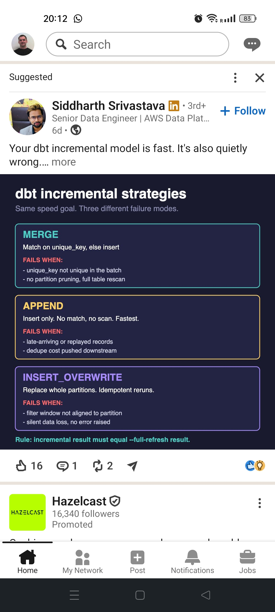

**BigQuery — refresh by partition, not full scan (cost optimization):**

The problem: `SELECT MAX(ingested_at) FROM {{ this }}` scans the **whole table** — expensive at 1B+ rows. BigQuery also only prunes partitions when the filter uses a **literal** value, not a subquery, so `WHERE date >= (SELECT MAX(date) ...)` scans everything anyway.

The fix: read the **partition metadata** (free — no data scan) instead of the data:

```sql
-- metadata only, finds which partitions changed
SELECT partition_id, last_modified_time, total_rows
FROM `project.dataset.INFORMATION_SCHEMA.PARTITIONS`
WHERE table_name = 'fct_orders'
  AND last_modified_time > TIMESTAMP_SUB(CURRENT_TIMESTAMP(), INTERVAL 3 DAY);
```

A dbt **macro** injects the latest partition id as a literal:

```sql
-- macros/latest_partition.sql

  
    SELECT MAX(partition_id)
    FROM `{{ relation.database }}.{{ relation.schema }}.INFORMATION_SCHEMA.PARTITIONS`
    WHERE table_name = '{{ relation.identifier }}'
  
  
  
    {{ return(result.rows[0][0]) }}
  
    {{ return(none) }}
  

```

```sql
-- models/fct_orders.sql
{{ config(
    materialized='incremental',
    incremental_strategy='insert_overwrite',
    partition_by={'field': 'order_date', 'data_type': 'date', 'granularity': 'day'},
    require_partition_filter=true
) }}

SELECT ...
FROM {{ ref('stg_orders') }}

  WHERE order_date >= '{{ latest_partition_id(this) }}'

```

**This is permanent code** (not a one-off script): the macro lives in `macros/` and is reused, and every `dbt run` executes the metadata query automatically. `require_partition_filter=true` makes dbt error if the partition filter is ever forgotten.

**Watch out:** use the **ingestion timestamp** (`ingested_at`), not a business-time column, and always add a lookback window so late rows aren't missed.

### 5.8 SQL conventions (SQLFluff style)

**What it is:** your team's linting style, enforced by `sqlfluff` + `pre-commit`.

- **4-space indentation**; `SELECT`, `FROM`, `WHERE`, `JOIN`, `CAST`, `COALESCE` in UPPERCASE.
- **Identifiers lowercase**; **trailing commas** in SELECT lists.
- **CTEs over subqueries** — `WITH` on its own line, CTE names indented 4 spaces, blank line between CTEs.
- **`ref()` / `source()` only** — never hardcoded table names.
- **No semicolons** at the end of scripts.
- **Explicit `AS`** on computed columns (`SUM(amount) AS total`) and table aliases (`FROM {{ this }} AS source`).
- **Reserved words** as aliases get backticks in BigQuery: `` day AS `date` ``.
- Suppress a lint rule on one line with `-- noqa: L042`, or all with `-- noqa`.

```sql
WITH
    source AS (
        SELECT *
        FROM {{ source('raw_orders', 'orders') }}
    ),

    renamed AS (
        SELECT
            order_id,
            ROUND(amount / 100.0, 2) AS amount_dollars
        FROM source
    )

SELECT *
FROM renamed
```

### 5.9 Quality checks (run before you push)

| Check | Command | What it catches |
|---|---|---|
| Build + test | `dbt build -s "stg_orders+"` | Broken SQL, failing tests |
| SQL lint | `sqlfluff lint models/` (or `sqlfluff fix`) | Style violations |
| YAML lint | `yamllint models/` | YAML formatting, long lines |
| Pre-commit | `pre-commit run --files <file>` | All hooks (dbt-checkpoint, semicolon, ref/source) |

**Why it matters:** these are the exact gates in your CI — passing them locally means your PR won't bounce in GitHub Actions.

### 5.10 Advanced dbt interview scenarios (Q&A)

**What it is:** the real-world problems interviewers ask about, with a one-line fix for each.

| # | Scenario | Simple-English solution |
|---|---|---|
| 1 | **Incremental models** — load only new/changed data, no duplicates | `materialized='incremental'` + `unique_key` + an `is_incremental()` filter; use `delete+insert` so the old row is replaced (§5.7) |
| 2 | **Late-arriving data** — out-of-order rows | Add a lookback window (re-scan N days) on `ingested_at`, not business time (§5.7) |
| 3 | **Schema evolution** — renamed/removed columns | Enforce a data contract (`contract.enforced` + `on_schema_change: fail`) and alias renames in staging (§6.1) |
| 4 | **Data quality & tests** — tests, thresholds, failures | Generic tests (`not_null`, `unique`, `relationships`, `accepted_values`) + custom singular tests; fail the build and alert (§6.2) |
| 5 | **Performance optimization** — slow models | Partition + cluster (BQ/Snowflake) or DISTKEY/SORTKEY (Redshift); filter before joining (§4) |
| 6 | **Snapshots / CDC** — track history over time | `dbt snapshot` with a `timestamp` strategy + `unique_key` → SCD2 (§5.2) |
| 7 | **Lineage & impact analysis** — what breaks if I change X | `dbt docs generate` (lineage graph) + `dbt ls` + `state:modified+` (§7.3) |
| 8 | **Macros & reusability** — keep the project DRY | Write Jinja macros for repeated logic (surrogate keys, dedup, audits) (§5.5) |
| 9 | **State-aware deployments** — run only what changed | `dbt build -s state:modified+ --defer --state prod/` (§7.3) |
| 10 | **CI/CD & automated testing** — reliable deployments | GitHub Actions runs `dbt build` + tests on every PR; block merge on failure (§7.3) |
| 11 | **Data contracts & docs** — trust and clarity | Enforced contracts + YAML descriptions + `` blocks (§5.5, §6.1) |

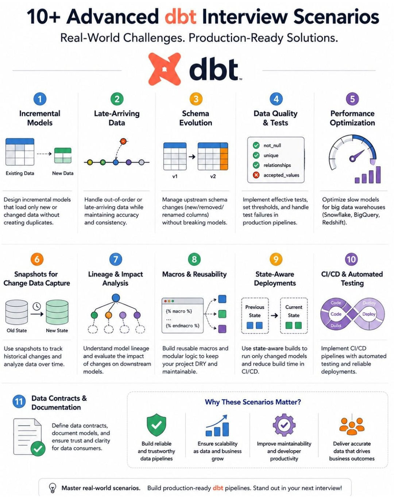

## 6. Data quality

### 6.1 Data contracts

**What it is:** a **contract** locks down a model's column names and types, so an upstream change fails the build instead of silently breaking things.

```yaml
# schema.yml
models:
  - name: fct_subscription_events
    config:
      contract:
        enforced: true        # check output vs these types at build time
      on_schema_change: fail  # fail if upstream adds/drops columns
    columns:
      - name: event_id
        data_type: varchar(64)
        tests:
          - not_null
          - unique
      - name: amount_usd
        data_type: numeric(18,2)
```

**Why it matters:** if an upstream team renames `customer_id` → `account_id`, `on_schema_change: fail` stops the pipeline at build time — instead of a dashboard silently showing wrong numbers.

### 6.2 Tests — 3 levels

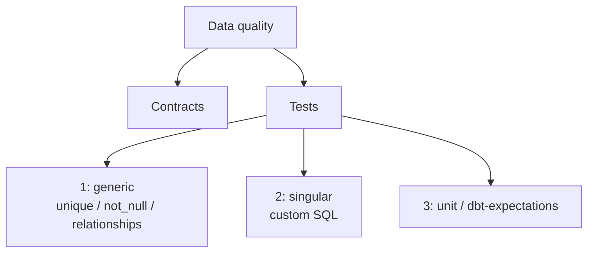

**Level 1 — generic tests** (built-in, declared in YAML):

```yaml
columns:
  - name: order_id
    tests:
      - not_null
      - unique
  - name: user_id
    tests:
      - relationships:
          to: ref('stg_users')
          field: user_id
  - name: status
    tests:
      - accepted_values:
          values: ['completed', 'refunded']
```

**Level 2 — singular tests** (custom SQL in `tests/`, return failing rows):

```sql
-- tests/assert_no_negative_amounts.sql
SELECT order_id
FROM {{ ref('stg_orders') }}
WHERE amount_dollars < 0
```

**Level 3 — unit tests / `dbt-expectations`** (richer assertions from the `dbt-expectations` package):

```yaml
- name: amount_dollars
  tests:
    - dbt_expectations.expect_column_values_to_be_between:
        min_value: 0
        max_value: 100000
```

**Rule of thumb:** at least **2 tests per model**, and the primary key always gets `not_null` + `unique`.

## 7. Agentic AI & CI

### 7.1 dbt project structure for AI agents

**What it is:** how to lay out a dbt repo so an AI agent (Claude Code, Cursor) can work on it safely. Your `.claude` folder is the template:

```
.claude/
  agents/        # sub-agents (e.g. sql-reviewer.md — read-only reviewer)
  rules/         # conventions the AI must follow
    sql-conventions.md
    yaml-conventions.md
    dimensional-model-conventions.md
  skills/        # reusable workflows (e.g. skills/develop/SKILL.md)
    develop/SKILL.md
  settings.json  # permission allow/deny list
dbt/
  models/
    <domain>/
      staging/dedup/
      staging/clean/
      intermediate/
      mart/
  sources.yml
dbt_project.yml
packages.yml
```

**Why small, single-purpose models:** an AI writes better SQL when each model does one thing (dedup, clean, join, aggregate) than when it must edit one giant 500-line CTE. YAML + tests give the agent "ground truth" to verify against.

### 7.2 Skills, agents & permissions

- **Context files** — `CLAUDE.md` (entry point) → `AGENTS.md` (the "brain": role, tech stack, directory structure, menu of skills).
- **Skills** — a `SKILL.md` that walks the agent through a workflow step-by-step: `/develop` (scaffold SQL + YAML), `/test` (run tests + spot-check), `/deploy` (commit + open PR), `/check-test-failures` (suggest fixes).
- **Sub-agents** — focused on-demand reviewers: `code-reviewer` (reviews SQL only), `doc-reviewer` (reviews YAML descriptions).
- **References (lazy-loaded)** — `dbt-conventions.md`, `sql-conventions.md`, `yaml-conventions.md`, `data-warehouse.md` — loaded only when the relevant task runs.
- **Permissions** (`settings.json`) — allow `dbt *`, `sqlfluff lint/fix`, `yamllint`, `pre-commit run`, `git log/diff/status/branch`; **deny** `rm -rf` and `git push --force`.

**Why it matters:** giving the AI explicit rules + permissions + tests means it can iterate without breaking the repo or inventing bad SQL.

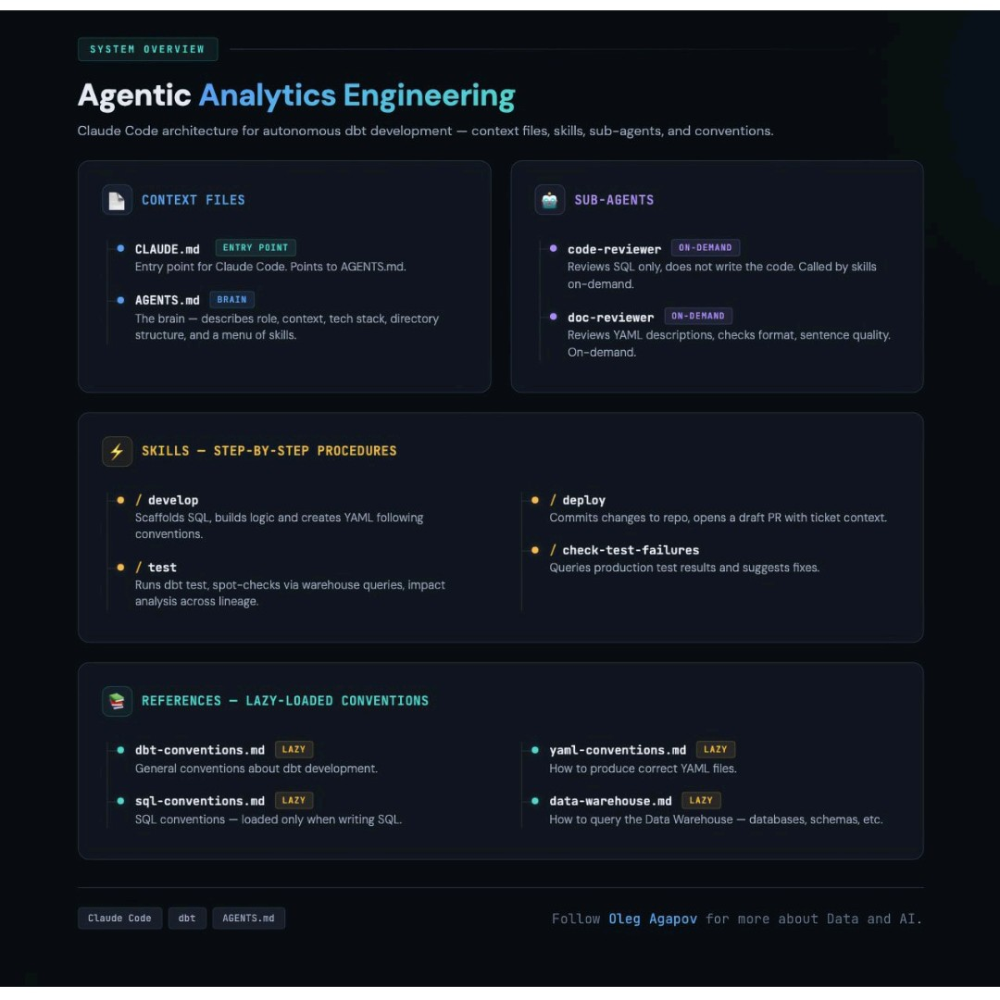

### 7.3 CI/CD (Slim CI)

**What it is:** when you open a PR, GitHub Actions runs `dbt build` on **only the changed models** (plus their downstream), against a temp schema.

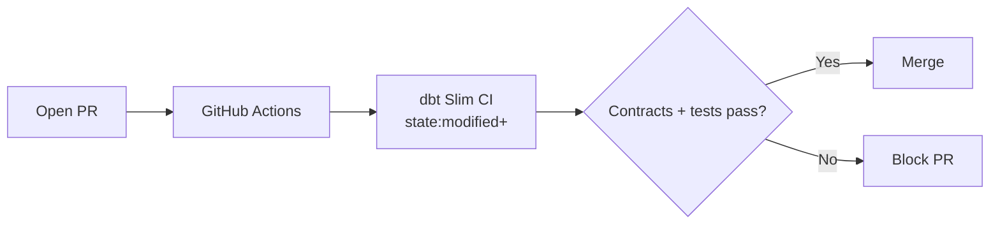

```yaml
# .github/workflows/dbt_ci.yml (key steps)
- name: Run dbt Slim CI
  env:
    DBT_PASSWORD: ${{ secrets.DBT_PASSWORD }}
  run: |
    dbt deps
    dbt build --target ci_schema \
      --select state:modified+ \
      --state ./state
```

**Why it matters:** Slim CI catches broken SQL, failing tests, and contract violations **before** merge — using `state:modified+` so it only builds what actually changed, keeping it fast.

**The full deployment flow (10 steps):**

1. **Feature branch** — create a Git branch, update models/tests/docs, run `dbt build` locally.
2. **Open a PR** — trigger automated checks + peer review.
3. **CI kicks in** — install deps, compile, run tests (pass/fail on the PR).
4. **Build in a PR schema** — validate transformations without touching prod tables.
5. **Deploy to staging** — validate row counts, freshness, metrics, joins.
6. **Reviewer approval + merge** — check naming, test coverage, performance, docs.
7. **CD triggers prod** — run `dbt build` in prod with `state:modified+`.
8. **Observability & alerts** — track run-time spikes, freshness failures, row-count anomalies.
9. **Publish docs** — `dbt docs generate` → docs site (keeps lineage updated).
10. **Schedule runs** — hourly/daily prod jobs with SLAs and freshness expectations.

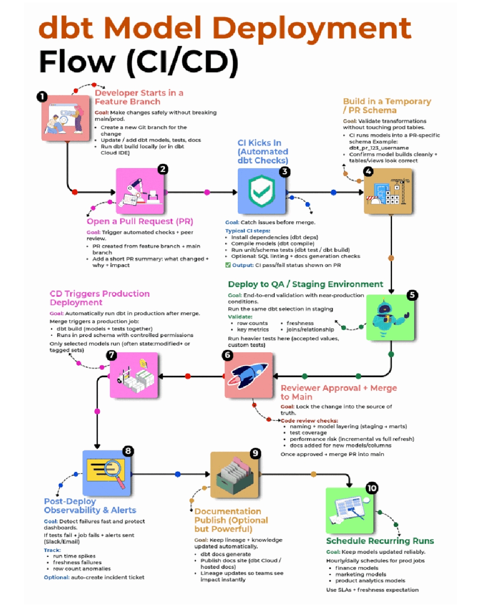


