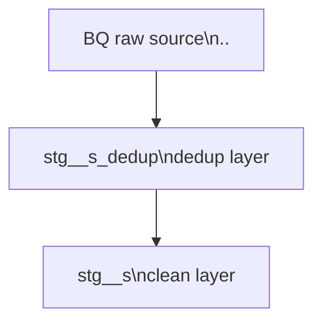

# Develop a new dbt staging model

Arguments: $ARGUMENTS

Follow these steps **in strict order**. Do not proceed to the next step until the current one
is complete and confirmed.

---

## Step 1 — Gather source metadata from BigQuery

**Ask the developer:**

> "Please provide the following three values:
> 1. BigQuery **project ID** (e.g. `my-project-prod`)
> 2. BigQuery **dataset name** (e.g. `raw_customer_rewards`)
> 3. Exact **table name** in that dataset (e.g. `customer_membership`)"

Once the developer provides those values, substitute them into the query below and
present the ready-to-run SQL:

```sql
SELECT
    cols.table_name,
    cols.column_name,
    cols.ordinal_position,
    cols.data_type,
    cols.is_nullable,
    fields.description AS column_description
FROM
    `<project_id>.<dataset_name>.INFORMATION_SCHEMA.COLUMNS`          AS cols
LEFT JOIN
    `<project_id>.<dataset_name>.INFORMATION_SCHEMA.COLUMN_FIELD_PATHS` AS fields
    ON  cols.table_catalog  = fields.table_catalog
    AND cols.table_schema   = fields.table_schema
    AND cols.table_name     = fields.table_name
    AND cols.column_name    = fields.column_name
WHERE
    cols.table_name = '<table_name>'
ORDER BY
    cols.ordinal_position
```

Instruct the developer:

> "Run this query in the BigQuery console. When results appear, click
> **Save results → Copy to Clipboard**, then paste directly into this chat."

The pasted output will be tab-separated with a header row, for example:
```
table_catalog   table_schema    table_name  column_name     data_type   description
my-project      my_dataset      my_table    order_id        STRING      Unique order identifier
my-project      my_dataset      my_table    created_at      TIMESTAMP   Record creation time
```

The exact columns present depend on which INFORMATION_SCHEMA view was used. Parse the
pasted block as follows — **only these four columns are needed**:

| TSV column header | What to extract |
|---|---|
| `column_name` | The source column name |
| `data_type` | BigQuery data type (STRING, INT64, TIMESTAMP, etc.) |
| `is_nullable` | YES / NO — used to decide `not_null` tests |
| `description` | Use verbatim if non-empty; flag as "needs AI suggestion" if empty or NULL |

Ignore all other columns (`table_catalog`, `table_schema`, `collation_name`,
`data_policies`, `policy_tags`, `rounding_mode`, etc.).

Once the TSV is parsed:
- Record every column name, data type, nullability, and description (may be empty)
- **Check for an ingestion timestamp column** — scan column names for `ingested_at`,
  `_ingested_at`, `_loaded_at`, or similar. If found, note the exact name; it will drive
  both the dedup `ORDER BY` and the incremental `WHERE` filter in later steps.
  If not visible in INFORMATION_SCHEMA results, explicitly ask the developer:
  > "Does this table have an ingestion/load timestamp column added by the pipeline
  > (e.g. `ingested_at`) that is not listed above? If yes, what is its exact name?"
- **Check for Google Datastream CDC metadata** — if the TSV shows a column named
  `datastream_metadata` with type
  `STRUCT<uuid STRING, source_timestamp INT64, change_sequence_number STRING, change_type STRING, sort_keys ARRAY<STRING>>`,
  this is a **Google Cloud Datastream append-mode CDC table**. Flag this immediately and
  apply the Datastream CDC variant rules in Steps 3a and 3b (see
  `## Variant — Google Datastream CDC sources (append-mode)` at the bottom of this file).
  Key differences: no `ingested_at` column; dedup uses `dwh_modified_timestamp ASC`;
  primary key is `datastream_metadata.uuid`; incremental filter uses `TIMESTAMP_SUB`.
- Open `dbt/models/sources.yml` and locate the correct `sources:` block for this source,
  or create a new one if it does not exist yet
- Add (or update) the table entry including a `columns:` list derived from the
  INFORMATION_SCHEMA results. Include the ingestion timestamp column even if it was not
  returned by INFORMATION_SCHEMA, for example:

```yaml
sources:
  - name: <source_name>
    database: <project_id>
    schema: <dataset_name>
    tables:
      - name: <table_name>
        columns:
          - name: column_name
            description: "Description from INFORMATION_SCHEMA, or empty if not set."
```

Save `dbt/models/sources.yml` before continuing.

---

## Step 2 — Confirm model directory and layer structure with the developer

**Ask the developer:**

> "Where should this model live?
>
> Suggested path: `dbt/models/<entity_domain>/staging/`
>
> A few questions to confirm the right structure:
> 1. Does this source table require **deduplication** (multiple schema versions, record
>    versioning with `version`/`table_version` columns, QUALIFY logic)?
>    - If **yes** → create two subfolders: `staging/dedup/` and `staging/clean/`
>    - If **no**  → a single `staging/` folder is enough
> 2. Should this go under an **existing** domain folder or is this a **new** domain?
>    New subfolders anywhere under `dbt/models/` are fine.
>
> Please confirm or provide the exact path(s)."

Wait for confirmation. Use the confirmed path(s) for all subsequent steps.

**If this is a new top-level domain** (i.e. `dbt/models/<new_domain>/` does not yet exist),
also add a new block to `dbt_project.yml` under `da_etl_canadian_analytics_engineering:`,
immediately before the `cae_single_run:` entry. Follow this pattern exactly:

```yaml
    <new_domain>:
      staging:
        dedup:
          +materialized: view
          +labels:
            team: "canadian-ae"
            table_tier: silver
        clean:
          schema: >
            
              clean_skip_data_lake
            
              {{ env_var('DBT_CUSTOM_DEV_SCHEMA', 'staging_cae') }}
            
          +labels:
            team: "canadian-ae"
            table_tier: silver
```

The `dedup` layer is always `view`; the `clean` layer inherits `incremental` from the
model's own `config()` block. Do not set `+materialized` on the `clean` block.

---

## Step 3 — Create the SQL file(s)

**Naming convention** (dbt best practice):
- File name: `stg_[source]_[entity]s.sql`  ← double underscore, entity is **plural**
- Example: `stg_customer_rewards_memberships.sql`

**Path**: as confirmed in Step 2.

### 3a — Dedup layer (`staging/dedup/`) — only if confirmed in Step 2

This model selects from the raw source and applies deduplication logic. Its only job is
to produce one clean row per primary key.

```sql
WITH
    source AS (
        SELECT *
        FROM {{ source('<source_name>', '<table_name>') }}
    ),

    deduplicated AS (
        SELECT *
        FROM source
        QUALIFY ROW_NUMBER() OVER (
            PARTITION BY -- _key_<entity_full_name>
                <grain_col_1>,
                <grain_col_2>,
                <grain_col_3>
            ORDER BY
                <ingested_at_col>
        ) = 1
    )

SELECT *
FROM deduplicated
```

**PARTITION BY** — use every column that forms the natural grain (same set as the
surrogate key). Add the comment `-- _key_<entity_full_name>` on the same line as
`PARTITION BY` to make the intent explicit.

**ORDER BY tiebreaker rules** — choose the first that applies:
1. **Google Datastream CDC** — PARTITION BY `(business_grain_cols, datastream_metadata.uuid)`
   ORDER BY `dwh_modified_timestamp ASC`. The `uuid` partitioning groups physical
   at-least-once delivery duplicates of the same CDC event; `ASC` keeps the first canonical
   write. All other CDC events (different uuid) are preserved as separate rows.
2. `<ingested_at_col> DESC` — when a non-Datastream ingestion timestamp was identified in
   Step 1 (preferred for re-ingestion dedup; ensures the latest loaded copy wins)
3. `version DESC, table_version DESC` — when the source has explicit schema version columns
4. Flag to the developer — if none of the above apply, the ORDER BY is arbitrary; confirm all
   duplicate rows are identical before proceeding

**Schema versioning variant** — only when the source has explicit `version`/`table_version`
columns or multiple schema-versioned tables to union: insert an `unioned` CTE between
`source` and `deduplicated` that UNIONs all schema version tables, casting fields to their
latest types. ORDER BY `version DESC, table_version DESC` in that case.

**Surrogate key rules:**
- **Non-Datastream sources**: use `{{ dbt_utils.generate_surrogate_key([...]) }} AS _key_<entity>` with the natural grain columns
- **Datastream CDC sources**: use `datastream_metadata.uuid AS _key_<entity>` directly — uuid IS the unique event identifier; `generate_surrogate_key()` must NOT be used for these tables
- **Single-column grain**: alias the source column directly — `id AS _key_<entity>`. Only use `generate_surrogate_key()` for composite (multi-column) grains. Hashing a single column adds compute with no benefit.

**Dedup YAML**: the entire dedup folder shares **one** YAML file named `_stg_<domain>_dedup.yml`
(use only the source-domain prefix, no entity suffix — never one YAML per SQL file).
When extending an existing dedup folder, append the new model entry to the existing shared YAML.

Requirements:
- CTEs only — no subqueries
- UPPERCASE keywords, lowercase identifiers
- `AS` aliases vertically aligned within each CTE's SELECT list
- 4-space indentation, trailing commas
- No semicolon at end of file
- No hardcoded project/dataset/table names — use `{{ source() }}` only in this layer

### 3b — Clean layer (`staging/clean/`)

This model references the dedup model (or the source directly if no dedup) and applies
final renaming, casting, snake_case conversion, and STRUCT organisation.
It is the **user-facing** model and preserves the 1-to-1 relationship with the source table.

```sql
{{
    config(
        materialized='incremental',
        incremental_strategy='merge',
        unique_key='_key_<entity_full_name>',
        partition_by={
            "field": "<date_col>",
            "data_type": "date",
            "granularity": "day"
        },
        cluster_by=['<grain_col_1>', '<grain_col_2>'],
        incremental_predicates=["DBT_INTERNAL_DEST.<date_col> >= DATE_SUB(CURRENT_DATE(), INTERVAL 7 DAY)"]
    )
}}
-- Partition by <date_col> to optimise BigQuery storage and query costs.
-- incremental_predicates limits the MERGE scan to recent partitions for cost efficiency.
-- <ingested_at_col> filter ensures we only process the latest batch from the raw table.

WITH
    source AS (
        SELECT *
        FROM {{ ref('stg_<source>_<entity>s_dedup') }}
        -- If no dedup layer: FROM {{ source('<source_name>', '<table_name>') }}
        
            WHERE <ingested_at_col> > (
                SELECT MAX(source_sub.<ingested_at_col>)
                FROM {{ this }} AS source_sub
            )
        
    ),

    renamed AS (
        SELECT
            {{ dbt_utils.generate_surrogate_key([...]) }} AS _key_<entity_full_name>,

            -- group label
            pass_through_col,
            TIMESTAMP_MILLIS(created_at)                AS created_at_utc,
            ROUND(amount / 100.0, 2)                    AS amount_dollars
        FROM source
    )

SELECT *
FROM renamed
```

Requirements:
- Same formatting rules as 3a
- `AS` aliases vertically aligned within each CTE's SELECT list
- All field renames to `snake_case` applied here
- Timestamps converted via `TIMESTAMP_MILLIS()` where applicable
- Monetary fields rounded to 2 decimal places where applicable
- No joins, no aggregations (staging is 1-to-1 with source — joins belong in intermediate models)

**Config block rules:**
- `unique_key`: always `_key_<entity_full_name>` — underscore-prefixed surrogate key named
  after the model entity; never `<entity>_id`
- `partition_by`: use the date dimension column (e.g. `day_utc`); include `data_type: date`
  and `granularity: day`
- `cluster_by`: use the natural grain columns that downstream queries will filter on;
  **never** include the partition column in `cluster_by`
- `incremental_predicates`: always add a 7-day window on `DBT_INTERNAL_DEST.<date_col>` to
  limit the BigQuery MERGE scan to recent partitions — this is the primary cost-control lever
- **Incremental WHERE filter**: use the ingestion timestamp column (`ingested_at`) identified
  in Step 1, not a business-time column like `hour_utc` or `created_at`
- **Datastream CDC incremental filter**: use `TIMESTAMP_SUB` for TIMESTAMP-partitioned tables:
  `WHERE dwh_modified_timestamp >= TIMESTAMP_SUB(CURRENT_TIMESTAMP(), INTERVAL N DAY)`.
  For DATE-partitioned tables use `DATE_SUB(CURRENT_DATE(), INTERVAL N DAY)`.
  NEVER use `DATE(<timestamp_col>)` in the filter — this converts TIMESTAMP to DATE and
  loses sub-day precision needed for the partition predicate pushdown.
- **INT64 epoch millisecond fields** (Datastream sources): convert with `TIMESTAMP_MILLIS(col) AS col_utc` — TIMESTAMP only, never DATE. `CAST(TIMESTAMP_MILLIS(...) AS DATE)` must not be used.
- **Datastream STRUCT reconstruction**: `datastream_metadata.source_timestamp` is INT64 inside
  the STRUCT and must be converted to TIMESTAMP. Reconstruct the entire struct with explicit
  `AS` aliases on every sub-field:
  ```sql
  STRUCT(
      datastream_metadata.uuid                   AS uuid,
      TIMESTAMP_MILLIS(
          datastream_metadata.source_timestamp
      )                                          AS source_timestamp,
      datastream_metadata.change_sequence_number AS change_sequence_number,
      datastream_metadata.change_type            AS change_type,
      datastream_metadata.sort_keys              AS sort_keys
  )                                              AS datastream_metadata
  ```
- **No double-select of old STRUCT**: in the `renamed` CTE, list ALL source columns explicitly
  (no `SELECT *`). The reconstructed `datastream_metadata` must be the only occurrence of that
  column — never select the original raw struct alongside the reconstructed one, or BigQuery
  will raise a duplicate column error.
- **Mixed materializations in same folder**: if two models in the same folder use different
  strategies (e.g. one `view`, one `incremental`), declare `materialized=` in each model's
  inline `{{ config() }}` block — do NOT add a folder-level `+materialized` override to
  `dbt_project.yml`. Makes each model's strategy visible without cross-referencing project config.

---

## Step 4 — Create the properties YAML file (clean layer only)

**Only create this file for the clean layer model.** No YAML for the dedup intermediate.

**File name**: `_[full_model_name].yml`  ← underscore-prefixed, one-to-one with the SQL file
**Example**: `stg_topsort_skip_behavior_summaries_by_hour.sql` → `_stg_topsort_skip_behavior_summaries_by_hour.yml`
**Path**: same directory as the clean layer SQL file confirmed in Step 2.

Populate the `columns:` list from the INFORMATION_SCHEMA results gathered in Step 1.
For columns that were renamed or newly computed during transformation, use the new name
and provide a description.

```yaml
version: 2

models:
  - name: stg_<source>_<entity>s
    description: >
      Staging model for <source> <entity> data.
      One row per <entity>.
    columns:
      - name: _key_<entity>
        description: Surrogate primary key derived from <grain_columns>.
        tests:
          - not_null
          - unique

      - name: field_one
        description: Description from INFORMATION_SCHEMA, or AI-suggested if empty.
        tests:
          - not_null

      - name: created_at_utc
        description: Record creation timestamp in UTC.

      - name: <date_col>
        description: partition_by column.
        tests:
          - not_null

      - name: ingested_at
        description: Timestamp when data was ingested by the pipeline.
```

Requirements:
- `version: 2` at the top of every properties file
- Use `tests:` (dbt-checkpoint convention used in this project)
- Minimum 2 tests per model (dbt-checkpoint enforces this)
- Primary key column always has both `not_null` and `unique`
- Every selected column has a non-empty `description:`
- Description style:
  - Short (fits within 150 chars): plain unquoted text — `description: Name of the vendor`
  - Multi-line or approaching 150 chars: `>` folded block scalar — wraps across lines
  - yamllint enforces a hard **150-character line limit** — lines beyond this fail CI
- Blank line between every `- name:` column block

---

## Step 5 — Run quality checks

Using the exact paths resolved in Steps 2–4, run in order and report each result:

```
dbt build -s "stg_<source>_<entity>s+"
sqlfluff lint <path_to_clean_layer_sql>
pre-commit run --files <path_to_clean_layer_sql> <path_to_yaml_file>
```

If a dedup layer was created, also lint it:

```
sqlfluff lint <path_to_dedup_sql>
pre-commit run --files <path_to_dedup_sql>
```

---

## Step 6 — Report

### 6a — Summary

Report the following:
- All files created with their full paths
- Tests added (column name → test name)
- Any lint or dbt errors found and whether they were resolved

### 6b — Create docs block file

Create `_<full_model_name>.md` in the **same directory as the SQL file** (co-located,
underscore-prefixed to match the YAML file).

**Example**: `dbt/models/skip_topsort/staging/clean/_stg_topsort_skip_behavior_summaries_by_hour.md`

**Do not create a separate `docs/` subfolder.** The docs file lives alongside the SQL and YAML.

**Content**: model-level `` block only — no per-column blocks.
Column descriptions live exclusively in the YAML file; do not duplicate them here.

```markdown

One row per <entity>. Sourced from `<dataset_name>.<table_name>`.
Applies deduplication (if applicable) and field standardisation.

```

Then append the lineage and ERD diagrams (Steps 6d and 6e) below the docs block.

### 6c — Materialization strategy recommendation

Provide a concrete BigQuery-specific recommendation — not generic advice:

| Layer | Recommended materialization | Reasoning |
|---|---|---|
| Dedup layer | `view` | Row-level filter only; no benefit from caching; always fresh |
| Clean layer | `table` if joined/aggregated heavily downstream; `view` if pass-through only | Avoids re-running dedup on every downstream query |
| Clean layer (high-volume, append-only source) | `incremental` with `merge` strategy, clustered on PK | Avoids full table scans; BQ clustering on the partition key reduces slot usage |
| Clean layer (simple projection, no QUALIFY/UNION) | Candidate for **BQ native materialized view** | BQ MV restrictions: no `QUALIFY`, no `UNION ALL`, no approximate functions — flag if eligible |

Flag any columns that are strong candidates for **clustering keys** based on expected
downstream `WHERE` / `JOIN` filter patterns.

### 6d — Mermaid lineage diagram

Append to the bottom of the docs `.md` file:

````markdown

````

If no dedup layer was created, omit the `DEDUP` node and draw directly `SRC --> CLEAN`.

If any downstream models already exist in the repo that `ref()` this clean model
(grep `dbt/models/` for `ref('stg_<source>_<entity>s')`), append them as additional nodes:

```
CLEAN --> DOWNSTREAM["`<downstream_model_name>`"]
```

### 6e — Mermaid ERD

Append after the lineage diagram:

````markdown
```mermaid
erDiagram
    STG_<SOURCE>_<ENTITY>S {
        <data_type> <entity>_id      PK
        <data_type> related_id       FK
        <data_type> field_one
        <data_type> created_at_utc
    }
```
````

- Column list and types come from INFORMATION_SCHEMA results (Step 1); if extraction
  was skipped, infer types from the SQL created in Step 3
- Mark `PK` on the primary key column
- Mark `FK` on any foreign key columns (identifiable by `_id` suffix referencing
  another entity)
- If the clean model `ref()`s another staging model (base model join pattern), add the
  relationship arrow with cardinality:

```
STG_<SOURCE>_<ENTITY>S }o--|| STG_<OTHER>_<RELATED>S : "<fk_column>"
```

- If the model is a pure 1-to-1 staging model with no joins, render only the
  single-entity diagram — do not fabricate relationships

---

## Variant — Extend an existing model (same grain, new columns)

Use this variant instead of the standard flow when the new source table:
- Has the **same grain** as an existing staged model (identical `PARTITION BY` / surrogate key columns)
- Adds new columns to that grain (e.g. a pipeline-enriched table like `behavior_summary_by_hour_with_segment_purchases` extending `behavior_summary_by_hour`)

**When to recognise this pattern:**
The new table name is typically a suffix of an existing source table name
(e.g. `<existing_table>_with_<new_data>`), shares the same primary key columns,
and has all the base columns of the existing model plus additional ones.

### What changes compared to the standard flow

| File | Action |
|---|---|
| `sources.yml` | Add the new table under the **same** `sources:` block as the existing table |
| `staging/dedup/<new_model>_dedup.sql` | Create new file — use identical `PARTITION BY` grain as the existing dedup model. Use `ORDER BY ingested_at DESC` if the table has an ingestion timestamp; comment it out if not |
| `staging/dedup/_stg_<domain>_dedup.yml` | **Append** the new dedup model entry to the **existing** dedup YAML — do not create a new file |
| `staging/clean/<new_model>.sql` | Create new file — mirror the existing clean model's `config()` block exactly (same `partition_by`, `cluster_by`, `incremental_predicates`). List all base columns first (pass-through), then the new columns in a clearly commented group |
| `staging/clean/_<new_model>.yml` | Create new file — reuse `{{ doc('col_...') }}` references for every column shared with the existing model; write new `` blocks only for the new columns |
| `staging/clean/<domain>.md` | **Append** new `` blocks to the **existing** `.md` file — do not create a new docs file |

### Surrogate key

Use the **same grain columns** as the existing model's surrogate key. The key name
must match the new model entity:
`_key_<new_entity_full_name>` — e.g. `_key_behavior_summary_by_hour_with_segment_purchases`.

### YAML column descriptions

For columns carried over from the existing model: always use `"{{ doc('col_...') }}"` —
never duplicate the description as inline text. For new columns: add ``
blocks to the existing domain `.md` file, then reference them with `"{{ doc('col_<name>') }}"`.

### Quality checks (same as standard flow)

```
yamllint dbt/models/<domain>/staging/clean/
sqlfluff lint dbt/models/<domain>/staging/clean/<new_model>.sql
pre-commit run --files dbt/models/<domain>/staging/clean/*
```

---

## Variant — Google Datastream CDC sources (append-mode)

Use this variant when INFORMATION_SCHEMA shows a `datastream_metadata` column of type
`STRUCT<uuid STRING, source_timestamp INT64, change_sequence_number STRING, change_type STRING, sort_keys ARRAY<STRING>>`.
Google Cloud Datastream delivers events at-least-once: the same CDC event (identified by
`uuid`) can land multiple times in BigQuery. A two-layer dedup+clean strategy handles this.

### Architecture

| Layer | Materialization | Purpose |
|---|---|---|
| Dedup (`staging/dedup/`) | `view` | Remove physical duplicate writes of the same CDC event |
| Clean (`staging/clean/`) CDC entities | `incremental`, `insert_overwrite` | Transform + partition by `dwh_modified_timestamp` |
| Clean (`staging/clean/`) reference tables | `table` | Dimension/reference data; no incremental needed |

### Dedup layer SQL pattern

```sql
WITH
    source AS (
        SELECT *
        FROM {{ source('<source>', '<table>') }}
    ),

    deduplicated AS (
        SELECT *
        FROM source
        QUALIFY ROW_NUMBER() OVER (
            PARTITION BY -- _key_<entity>
                <business_grain_col_1>,
                datastream_metadata.uuid
            ORDER BY
                dwh_modified_timestamp ASC
        ) = 1
    )

SELECT *
FROM deduplicated
```

`ORDER BY dwh_modified_timestamp ASC` keeps the first physical write of each uuid. Multiple
distinct CDC events (different uuids) for the same business entity are all preserved.

### Clean layer SQL pattern — CDC incremental entities

```sql
{{
    config(
        materialized='incremental',
        incremental_strategy='insert_overwrite',
        unique_key='_key_<entity>',
        partition_by={
            'field': 'dwh_modified_timestamp',
            'data_type': 'timestamp',
            'granularity': 'day'
        },
        cluster_by=['<high_cardinality_filter_col>', ...],
        post_hook=[
            "ALTER TABLE {{ this }} DROP PRIMARY KEY IF EXISTS",
            "ALTER TABLE {{ this }} ADD PRIMARY KEY (_key_<entity>) NOT ENFORCED"
        ]
    )
}}

WITH
    source AS (
        SELECT *
        FROM {{ ref('stg_<domain>_<entity>_dedup') }}
        
            WHERE dwh_modified_timestamp >= TIMESTAMP_SUB(CURRENT_TIMESTAMP(), INTERVAL 1 DAY)
        
    ),

    renamed AS (
        SELECT
            datastream_metadata.uuid                   AS _key_<entity>,
            col_one,
            col_two,
            TIMESTAMP_MILLIS(int64_epoch_col)          AS int64_epoch_col_utc,
            dwh_created_timestamp,
            dwh_modified_timestamp,
            STRUCT(
                datastream_metadata.uuid                   AS uuid,
                TIMESTAMP_MILLIS(
                    datastream_metadata.source_timestamp
                )                                          AS source_timestamp,
                datastream_metadata.change_sequence_number AS change_sequence_number,
                datastream_metadata.change_type            AS change_type,
                datastream_metadata.sort_keys              AS sort_keys
            )                                          AS datastream_metadata
        FROM source
    )

SELECT *
FROM renamed
```

### Clean layer SQL pattern — reference / dimension tables

```sql
{{
    config(
        materialized='table',
        cluster_by=['<cluster_col>'],
        post_hook=[
            "ALTER TABLE {{ this }} ADD PRIMARY KEY (_key_<entity>) NOT ENFORCED"
        ]
    )
}}
```

No `DROP PRIMARY KEY` needed for `table` — the table is recreated on every run.

### Key rules (all mandatory)

| Rule | Detail |
|---|---|
| Primary key | `datastream_metadata.uuid AS _key_<entity>` — never `generate_surrogate_key()` |
| Incremental filter (TIMESTAMP partition) | `WHERE dwh_modified_timestamp >= TIMESTAMP_SUB(CURRENT_TIMESTAMP(), INTERVAL N DAY)` |
| Incremental filter (DATE partition) | `WHERE <date_col> >= DATE_SUB(CURRENT_DATE(), INTERVAL N DAY)` |
| INT64 epoch fields | `TIMESTAMP_MILLIS(col) AS col_utc` — TIMESTAMP only, never DATE |
| STRUCT reconstruction | Explicitly alias every field; `source_timestamp` converted via `TIMESTAMP_MILLIS()` |
| No double-select | In `renamed` CTE, list all columns explicitly — never `SELECT *`; old struct must not appear alongside reconstructed struct |
| Lookback windows | CDC entities: 1 day; topsort daily/weekly: 14 days; topsort monthly: 60 days; topsort hourly: 14 days (DATETIME_SUB) |

---

## Variant — Raw SQL BQ CLONE (mart-only domain scaffold)

Use this variant when the goal is to clone an external BigQuery table into `datamart_cae`
as-is, with staging and intermediate folders scaffolded but empty. The SQL will be
refactored later; right now it is a zero-copy pass-through.

**When to recognise this pattern:**
- Source table lives outside this project (different GCP project or dataset)
- No transformation logic required yet — exact copy of source structure
- Source reference is expected to change over time → do **not** register in `sources.yml`
- Target dataset is `datamart_cae` (gold tier)

### dbt_project.yml block

Add under `da_etl_canadian_analytics_engineering:`, immediately before `seeds:`.
All three layers must be declared even if staging and intermediate are empty — this
ensures future models inherit correct defaults without needing extra config changes.

```yaml
    <new_domain>:
      staging:
        +materialized: view
        schema: >
          staging_cae
          {{ env_var('DBT_CUSTOM_DEV_SCHEMA', 'staging_cae') }}
        +labels:
          team: "canadian-ae"
          table_tier: silver
      intermediate:
        +materialized: view
        schema: >
          staging_cae
          {{ env_var('DBT_CUSTOM_DEV_SCHEMA', 'staging_cae') }}
        +labels:
          team: "canadian-ae"
          table_tier: silver
      marts:
        +materialized: raw_sql
        schema: >
          datamart_cae
          {{ env_var('DBT_CUSTOM_DEV_SCHEMA', 'staging_cae') }}
        +labels:
          team: "canadian-ae"
          table_tier: gold
```

### Folder structure

```
dbt/models/<new_domain>/
  staging/.gitkeep          ← git placeholder; no models yet
  intermediate/.gitkeep     ← git placeholder; no models yet
  marts/<model_name>.sql
  marts/_<model_name>.yml
  marts/_<model_name>.md
```

### Mart SQL pattern

The model name is the **target** table name (not prefixed with `fact_`/`stg_` unless
intentional). The source reference is hardcoded with backtick quoting because:
- The source is not owned by this project and will change
- Registering a volatile external table in `sources.yml` creates false lineage

```sql
{{ config(materialized='raw_sql') }}

CREATE OR REPLACE TABLE {{ this }}
CLONE `<source_project>.<source_dataset>.<source_table>`
```

`{{ this }}` resolves to the correct target relation (`datamart_cae.<model_name>` in prod)
via the schema routing in `dbt_project.yml`. No `SELECT` statement is needed — BigQuery
CLONE is a zero-copy metadata operation.

### Properties YAML pattern

- Grain is typically the natural PK of the source table — confirm before writing tests
- Fetch schema via BQ REST API: `bq show --schema --format=prettyjson <project>:<dataset>.<table>`
  or via `curl` with an ADC token if the bq CLI auth is unavailable in non-interactive mode
- Map BQ types to dbt `data_type:`: STRING→string, INT64/INTEGER→integer, FLOAT64/FLOAT→float,
  DATE→date, DATETIME→datetime, TIMESTAMP→timestamp, BOOL→boolean
- Use `` blocks in the paired `.md` file for column descriptions;
  reference them in the YAML as `description: '{{ doc("<model>__<column>") }}'`
- Minimum 2 tests: `dbt_utils.unique_combination_of_columns` on the grain + `not_null` on
  each grain column

```yaml
version: 2

models:
  - name: <model_name>
    description: >
      <One-line business description>.
      Cloned from <source_project>.<source_dataset>.<source_table>.
      Grain: one row per (<grain_col_1>, <grain_col_2>).
    tests:
      - dbt_utils.unique_combination_of_columns:
          combination_of_columns:
            - <grain_col_1>
            - <grain_col_2>
    columns:
      - name: <grain_col_1>
        data_type: <type>
        description: '{{ doc("<model_name>__<grain_col_1>") }}'
        tests:
          - not_null

      - name: <grain_col_2>
        data_type: <type>
        description: '{{ doc("<model_name>__<grain_col_2>") }}'
        tests:
          - not_null
```

### Docs file pattern

One `` block per column, named `<model_name>__<column_name>` (double underscore).
Source descriptions can be sourced from the upstream repo SQL files if available
(look for inline comments, CTE column comments, or a linked data dictionary).

```

<Description sourced from upstream SQL comments or data dictionary.>

```

### Quality checks

```bash
pre-commit run --files \
  dbt_project.yml \
  dbt/models/<domain>/marts/<model_name>.sql \
  dbt/models/<domain>/marts/_<model_name>.yml \
  dbt/models/<domain>/marts/_<model_name>.md
```

`dbt build` is not applicable for `raw_sql` models — run `dbt run` instead:

```bash
source venv/bin/activate
dbt run -s "<model_name>"
```

### Key rules

| Rule | Detail |
|---|---|
| No `sources.yml` entry | Volatile external sources must not be registered — use hardcoded backtick ref |
| `materialized='raw_sql'` on model | Overrides nothing — domain config already sets it; include in model config for explicitness |
| Source description preserved | When renaming the model, keep the `Cloned from ...` description pointing at the original source table name |
| `.gitkeep` in empty folders | Git does not track empty directories — always add `.gitkeep` to staging/ and intermediate/ |
| Run command | `dbt run -s "<model_name>"` — `dbt build` runs tests which require the CLONE to have completed first; run tests separately with `dbt test -s "<model_name>"` |

---

## Mart layer conventions

Applies to models in `skip_retail_media/marts/` (and any future mart domain).

### Key naming

Mart PK columns must be named `_key_<prefix>_<model_name>` — the full mart table name,
not the intermediate entity name. The prefix matches the mart table's own name prefix
(data product name, entity group, or domain — whatever prefix the mart tables share).

```sql
-- correct: mart renames the int key to include the mart table prefix
_key_restaurant_promotions_corp_vendor AS _key_retail_media_corp_vendor  -- prefix: retail_media
_key_corp_campaign                     AS _key_orders_campaign           -- prefix: orders (hypothetical)

-- wrong: keeps the int-layer name — ambiguous to downstream consumers
_key_corp_vendor AS _key_corp_vendor
```

The prefix is determined by the mart table names in that domain:
- `retail_media_campaigns`, `retail_media_corp_vendor` → prefix `retail_media_`
- A future `orders_campaign`, `orders_vendor` domain → prefix `orders_`
- When mart tables have no shared prefix, use the entity name directly: `_key_<model_name>`

The renaming happens at the **int layer** (`renamed` CTE); the mart is a clean pass-through
with no alias. The intermediate model keeps its own key name unchanged.

### Symmetric join keys

Every mart-to-mart join must use the **same column name on both sides** — `col = col`,
never `col_a = col_b`.

If the two models don't share a natural column name, add an alias in the `renamed` CTE
of **each** model (not just one side), so the join label is symmetric:

| Left model | Alias to add | Right model | Alias to add | Join label |
|---|---|---|---|---|
| `retail_media_campaigns` | `id AS campaign_id` in int | `retail_media_corp_campaign_restaurant` | `corp_campaign_id AS campaign_id` in int | `campaign_id = campaign_id` |

Rule: when adding a new mart join, check both sides. If neither side has a matching column
name, add the alias to both int models, update their YAML, and update the Mermaid diagram.

### No transformations in the mart layer

The mart layer contains **only key renaming** (adding the `_key_retail_media_` prefix).
No business column aliases, no computation. All aliasing belongs in the int model's
`renamed` CTE — the mart passes everything through.

---

## Lookup CTE conventions (SELECT DISTINCT pattern)

When a column is missing from the primary model grain and must be pulled in from another
table via `SELECT DISTINCT`, the join key **must be the entity's own UUID** — not a
related entity's key.

**Rule:** ask "is this join key the primary identifier of the entity whose attribute I am
looking up?" If not, find the correct entity-level UUID.

```sql
-- CORRECT: vendor's own UUID is the join key — 1:1 guaranteed
vendor_lookup AS (
    SELECT DISTINCT
        string_vendor_id,
        external_vendor_id
    FROM {{ ref('stg_topsort_skip_behavior_summaries_by_hour') }}
),
-- join: ON wsp.string_vendor_id = vl.string_vendor_id

-- CORRECT: marketplace's own UUID is the join key — 1:1 guaranteed
marketplace_lookup AS (
    SELECT DISTINCT
        string_marketplace_id,
        marketplace_name
    FROM {{ ref('stg_topsort_skip_behavior_summaries_by_hour') }}
),
-- join: ON wsp.string_marketplace_id = mpl.string_marketplace_id

-- WRONG: campaign ID is not the vendor's identifier — a campaign could map to
-- multiple vendors (e.g. vendor reassignment), causing silent fan-out on the join
vendor_lookup AS (
    SELECT DISTINCT
        string_campaign_id,   -- wrong — this is the campaign key, not the vendor key
        external_vendor_id
    FROM {{ ref('stg_topsort_skip_behavior_summaries_by_hour') }}
),
```

**Why it matters:** if the join key is not the entity's own UUID, `SELECT DISTINCT` can
return multiple rows for one key value. A downstream `QUALIFY ROW_NUMBER()` ordered by an
unrelated column (e.g. segment date) will then silently pick an arbitrary row, corrupting
the looked-up value.

**Before shipping:** verify the 1:1 relationship in production with a BQ query:

```sql
SELECT string_vendor_id, COUNT(DISTINCT external_vendor_id) AS n
FROM `<project>.<dataset>.<table>`
GROUP BY string_vendor_id
HAVING n > 1
LIMIT 10
-- 0 rows = safe; any rows = fan-out risk, pick a better key or add tie-breaking QUALIFY
```
